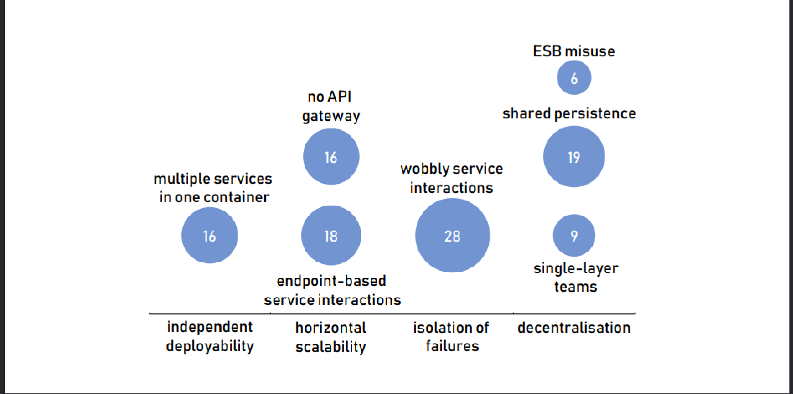
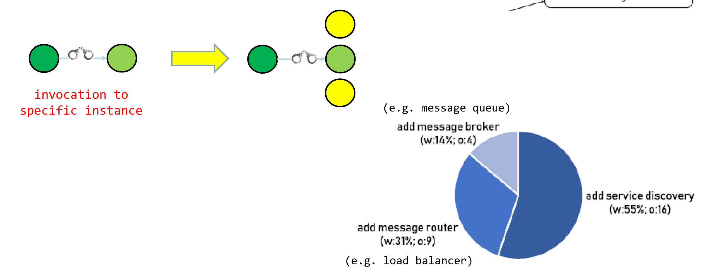
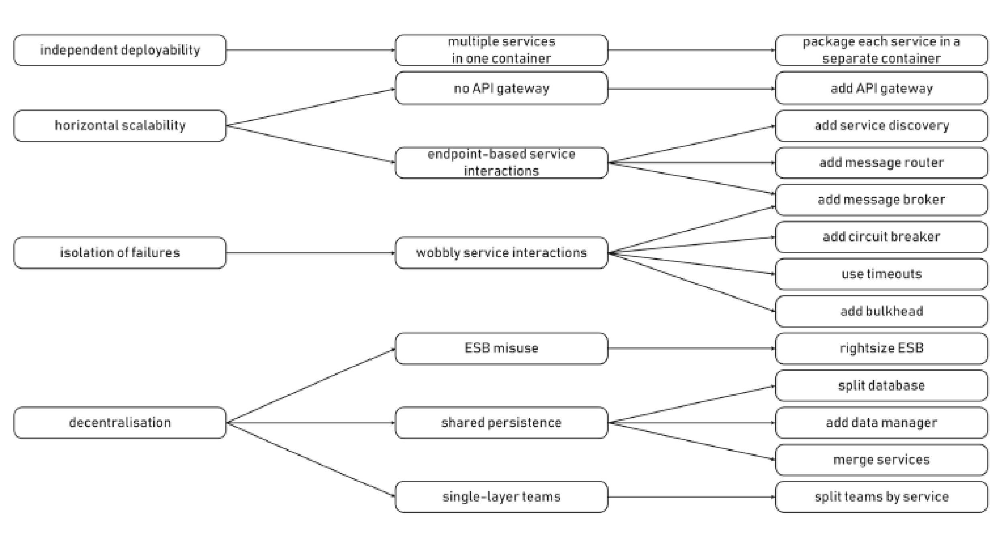
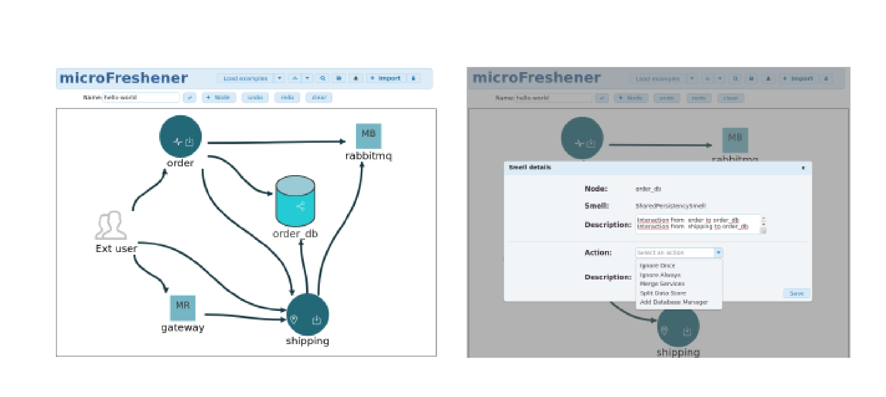
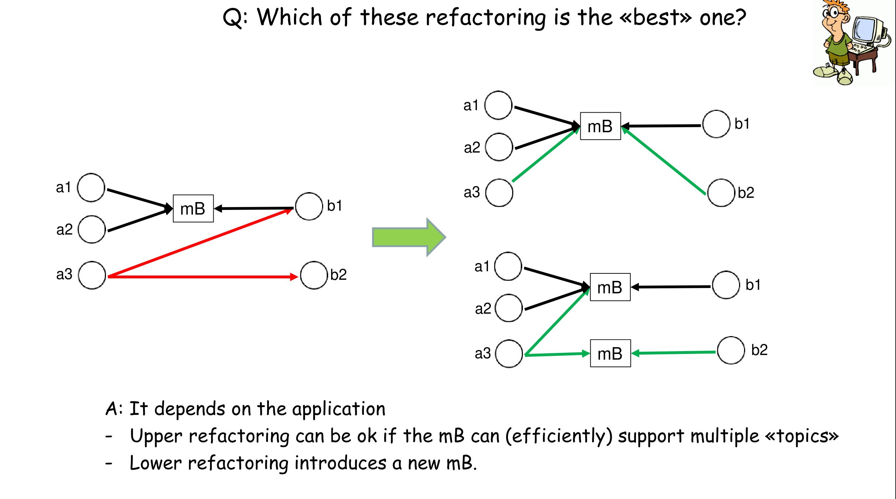

# Design principles, architectural smells and refactoring of microservices

> How can architectural **smells** affecting design **principles** of microservices be detected and resolved via **refactoring**?

## Design principles

- Indipendent deployability
  
    The microservices forming an applications should be independently deployable

- Horizontal scalability
  
    microservices should be horizontally scalable &rarr; add/remove replicas of single microservices

- Isolation of failures

- Decentralization
  
    should occur in all aspect of microservice-based applications, from data management to governance

## Architectural smells

- Multiple services in a container

- Endpoint based service interactions
  
    

- No API gateaway 
  
  app must invoke directly app services &rarr; add API gateaway (can be useful for authentication, throttling etc.)

- Wobbly service interactions
  
    Interaction of m1 with m2 is **wobbly** when a failure of m2 triggers a failure of m1

    Solutions:
        
    - add bulkhead
    - use timeouts
    - add circuit breaker
    - add message broker

- Shared persistence
  
    Multiple services share the same DB

    Solutions:

    - add data manager
    - merge services
    - split DB
- ESB (Enterprise Service Bus) misuse

- Single Layer teams &rarr; split teams by services
  

## $\mu$Freshener

A web-based GUI for 
- editing app specification
- automatically identify architectural smells
- apply architectural refactorings

$\mu$Freshner works at the architectural level, concrete implementation is left to application manager, which means thtat we can also ignore some smells when they are deemed not that impacting.

There can be multiple refactorings, the best one depends on the application and its constraints.

