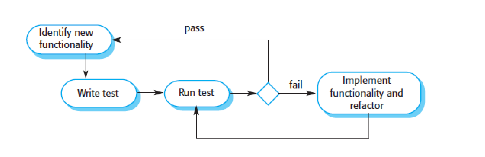
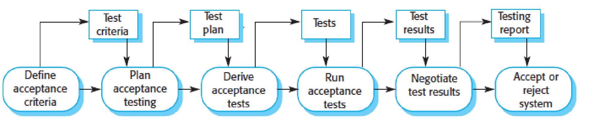

# Testing

**Essence** 
    
- Execute program with artificial data
- Check results of test run for errors/anomalies/non-functional info

**Objectives** 

- show that program does what is intended to do (**validation testing**)
- discover program defects before it is put into use (defect testing)

> Testing only show presence of errors, not their absence (Dijkstra)

## Verification & Validation (V&V)

Testing part of broader software validation & verification process

- **Software verification** checks that software meets functional and non-functional requirements
- **Software validation** checks that software meets customer's expectations

The goal: estabilish that the software is "fit for purpose"

- Software purpose: the more critical the software, the more important its reliability
- User expectation: lower for new products, higher for pre-existing ones
- Marketing environment: Getting product to market early > fully testing it

V&V also includes inspections that performs static analyses of  requirements, design, source code

Advantages of inspection:
- During testing, errors can mask other errors
- Incomplete system can be inspected with no additional cost
- We <u>PROVE</u>  that P |= Inv
  
## Traditional testing process

Test cases specify test input data and expected system output

Test data can be auto generated (not test cases)

Automated execution

## Traditional stages

- Development testing
  
    Testing system during development to discover bugs and defects (carried out by development team)
- Release testing
  
    Testing complete version of system before user release (usually NOT done by developers)
- User testing
  
    Users testing system in their own enviroment

## Development testing

- Unit testing
- Component testing 
- System testing
  
### Unit testing 

Unit tests should: 
- shows that unit does what is supposed to do 
- reveal unit defects
  

**Partition testing strategy**
- Identify groups of inputs that should be treated equally 
- choose tests from each group 
- rule of thumb: choose test cases on boundaries and at midpoint  of each partition

**Guideline-based testing strategy**

- Design test cases by using existing guidelines, e.g.
  - test sequences of different size, including 0 and 1
  - Inputs that forces the system to generate all error messages
  - force invalid outputs to be generated

### Component testing

Testing *interfaces* of components (integrating several units)

Most common errors:
- Interface misuse (e.g parameters in wrong order/number)
- Interface misunderstanding 
- Timing errors

Interface testing guidelines:

- Design tests so that parameters are at the extreme ends of their ranges
- Always test pointer parameters with null
- Design tests that cause component faliure
- Use stress testing in message passing systems (many more messages than likely)
- In shared memory systems, vary the order of component activation
  

**Inspections can be more effective than testing in finding interface errors**

### System testing

Development  integrate components  to create a version of the system 

- Components developed by different developers/teams , off the shelf systems integrated
- Testing the integrated system is a collective process, sometimes delegate to a separate testing team
  

Focus: test components interactions

Checking that components are compatible, interact correctly and transfer the right data at the right time across their interfaces.

Testing "emergent behavior" of the system

Use case based testing

How much system testing is necessary?

- Exhaustive system testing is impossible 

- Testing policies to define required system test coverage are developed, e.g.

  - All system functions that are accessed through menus should be tested

  - Combinations of functions that are accessed through the same menu must be tested

  - Where user input is provided, all functions must be tested with correct & incorrect input

## Test Driven Development

"First test, than code"

Develop code incrementally, with a test for each increment

Move to the next increment after passing the written test

Passing test the critical driver of development

New functionality is usually small and implementable in few lines of code

### PROS 

- Code coverage 
  
  Each code segment has at least one associated test

- Regression testing
  
    To check that changes  have not broken previously working code
    
    Regression test suite developed incrementally as program is developed

    Regression tests can be run to check that new changes have not introduced bugs

- Simplified debugging
  
     When a test fails, it should be obvious where the problem lies

- System documentation
  
  The tests themselves are documentation of what the code should be doing.

## Release testing 

Testing release of system intended for use outside of development team

Primary goal: convince system supplier that is good enough to use

Black box tests derived from system specification

It is a form of system testing:
- Separate not developing team should be responsible

- Objective of release testing is to check that the system meets its requirements and is good enough for external use (validation testing)

Requirements-based testing

▪ Design test(s) for each requirement

▪ Validation testing

Scenario testing

▪ Exploit typical scenarios of use to develop test cases

▪ A scenario is a (narrative) realistic story

Performance testing 

▪ Check that system can process its intended workload

▪ Operation profiles* employed to test whether performance requirements are being
achieved

    *Operation profile = class of system inputs and probability that those inputs will occur in normal use

▪ Stress testing for defect testing

- Gradually increase load till passing system limit

## User testing 

Users provide input and advice on system testing

Essential, users real working environment can't be fully replicated but it can impact reliability/performance/usability of system

Types of user testing:

- **Alpha testing**
  - Users work with development team to test early releases of software

- **Beta testing** 
  - Release made available to larger group of users, allowing them to experiment and raise problems discovered to the system developers

- **Acceptance testing**
  
    - Customers test a system to decide whether or not it is ready to be accepted from the system developers and deployed in the customer environment

Acceptance criteria should in principle be part of system contract (in practice requirments change during development)

Outcome of negotiations can be conditional acceptance, e.g deploy even with problems that needs to be fixed

Agile methods and acceptance testing

• Agile methods do not include in principle acceptance testing (as users are 
embedded in the development team, provide reqs and define tests)

• Difficult to embed «typical users» with general knowledge of system

• Many companies develop agile but have acceptance testing too