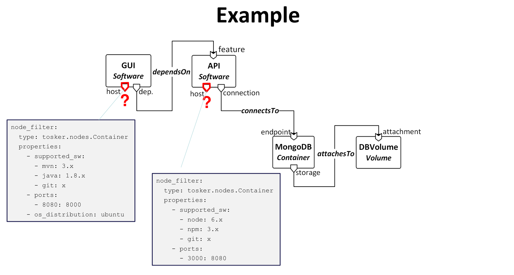
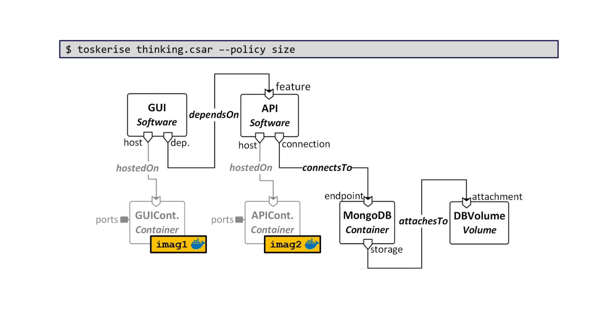
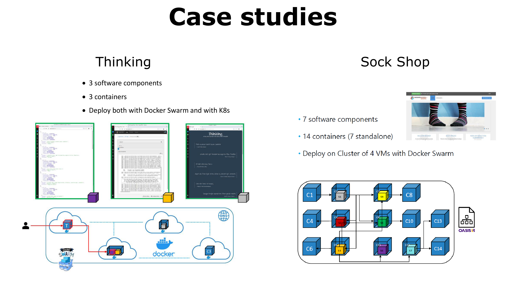
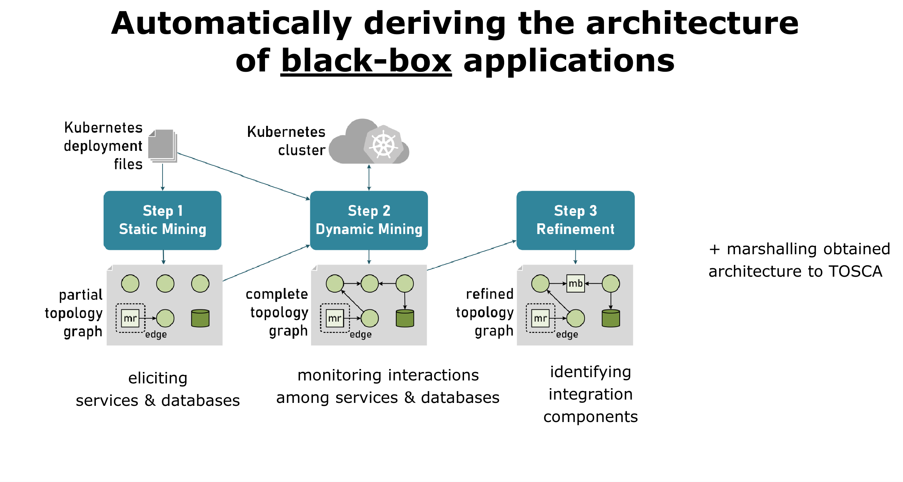
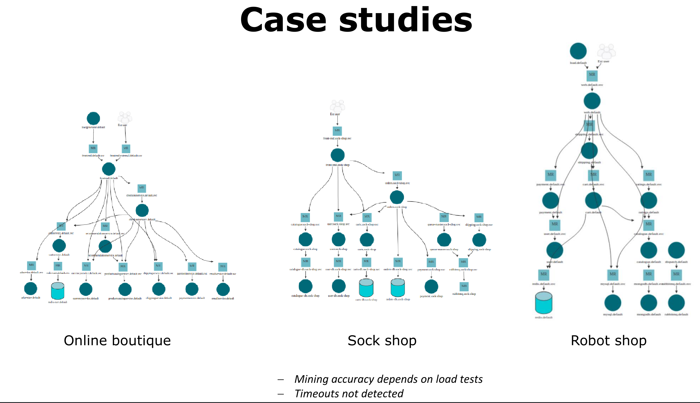

# Microservices toolchain

## $\mu$Tosca toolchain

**Microfreshner: UI to get automated analysis of microservices application architecture**

Uses tosca format and detects architectural smells.

## Motivations

1. Microservice based applications integrate many integrating services
2. Need to select an appropriate runtime environment for each microservice
3. Need to package each microservice into the selected runtime environment

### Select an appropriate runtime environment for each microservice

**IDEA:** Exploit tosca based representation of microservices based applications to **specify only the application components and the required software support**

**IDEA:**	Develop a tool for **automatically completing (and updating) TOSCA application specifications by discovering and including Dockker-based  runtime environments** providing the software support required by each microservice.

### Package each microservice into the selected runtime environment

**IDEA**: develop a tool to **automate the deployment on top of existing container orchestrators**

  - Ingredients:
    		- a process management system inside containers
        		- a service for component-aware orchestration
        		- a packager capable of deploying on existing container orchestrators

## Automatically deriving the architecture of a <u>blackbox</u> application

- Static mining

  - try to reconstruct applications using data (kubernet deployment files). Produces a first partial graph of servises and databases

- Dynamic mining

  - use load testing on kubernets clustering to monitor interactions among services & databases

- Refinement

  - identifying integration components (message brokers, message routers, )

  At the end we marshall everything obtained to tosca

  - Mining accuracy depends on load tests
  - Timeouts not detected

The user can still modify the tosca file produced

## Two remarks

- Take home message: A (minimal) modelling of microservice-based applications can considerably simplify their design and analysis and allow automating their container-based completion and deployment.

## Cascading failures

### Issues

- distributed logs &Rarr; logstash

- correlation is not causation &rarr; log analysis with minimal info on service behaviour 

  ### Minimale info on service behaviour example

  Service behaviour described by a FSM

  - states associated with (conditions on) service ***requirements*** and ***capabilities***
  - normal and  fault-handling transitions
  - 
  
  ### Log analysis: example
  
  Why did service instance i pass from state s at time t to state s' at time t'?
  
  Possible reasons:
  
  - a management operation on i was executed
  - i unexpectedly failed on its own
  - i had to handle a failure caused by another service instance that stopped providing one of i's requirements
  
  **Idea**:Algorithm to iteratively generate a causality graph, "travelling back in time"
  
  (EXample chaos testing)
  
  Extensions:
  
  - Deal with non-deterministic services
  - Deal with "log gaps"
  - Combine multiple runs