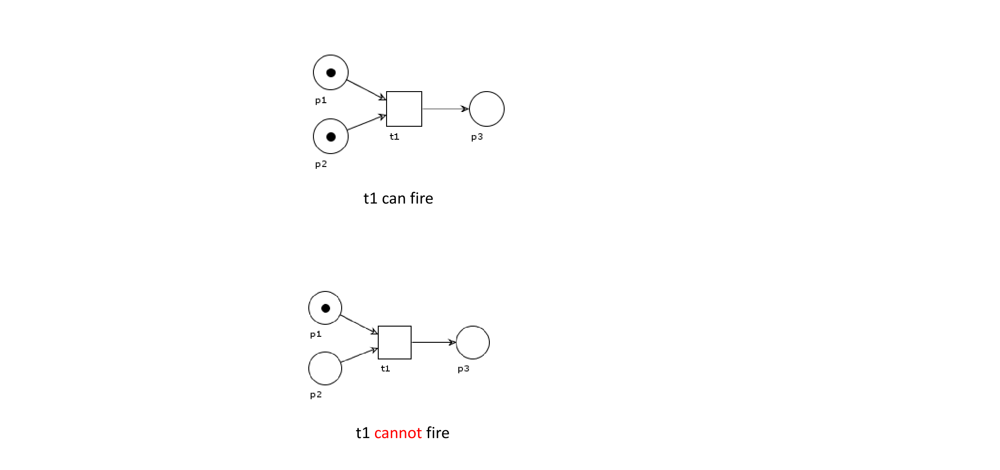

# Business Process Modelling

## Business processes

**Business process management** is the systematic method of examining your organization's existing business processes and implementing improvements to make your workflow more effective and more efficient.

A **business process** is a set of business activities that represent the required steps to achieve a business objective.

## Business process models

A **business process model** consists of a set of activity models and execution constraints among them.

A **business process instance** represent a concrete case in the operational business of a company, consisting of activity instances.

## BPMN: Business  Process Model and Notation

Graphical notation for business process modeling

There are many tools available for BPMN

**Problem**:

Semantics of BPMN operators is defined in natural language

500 pages of specs, ambigous definitions

We would like to use a more formal method in order to **prove** properties of business processes models

# Workflow nets

Extension of petri nets

One of the best known techniques for specifying business processes in a formal and abstract way

- Graphical representation eases communications between different stakeholders
- Process properties can be formally analyzed 
- Various supporting tools are available

## Petri nets

Petri nets consist of places, transitions and direct arcs connecting places to transitions.

Transitions model activities, places and arcs model execution constraints.

System dynamics represented by tokens, whose distribution over the places determines the state of the modelled system.

A transition can _fire_ if there is a token  in each of its input places

If a tranistion _fires_, one token is removed from each input place and one token is added to each output place

## Workflow nets

Idea: Enhance Petri nets with concepts and notations that ease the representation of business processes

Like petri nets, workflow nets focus on the control flow behaviour of a process:

- transitions represent activities
- places represent conditions
- tokens represent process instances

> A Petri net is a workflow net iff:
>
> 1. There is a unique source place, with no incoming edge
> 2. There is a unique sink place, with no outgoing edge
> 3. All places and transitions are located in at least one path from the initial place to the final place
>
> 

Equivalent "sugared" representation of AND-split and AND-join transitions

Transitions can be annotated with _triggers_, to denote who/what is responsible for an enabled transition to fire

### Soundness

> A workflow net is sound iff:
>
> 1. every net execution starting from the initial state (one token in the source place, no tokens elsewhere) eventually leads to the final state (one token in the sink place, no tokens elsewhere)
> 2. every transition occurs in at least one net execution

How to formally (and automatically) establish whether a net is sound?

> A Petri net (PN, M) is **live** if and only if for every reachable state M' and every transition t, there is a state M'' reachable from M' where t is enabled.

> A Petri net(PN, M) is **bounded** if and only if for each place p there is a $n \in \N$ such that  for each reachable state M'  the number of tokens in p in M' is less than  n

 

> Theorem: a workflow net $N$ is sound if and only if  (N',{i}) is live and bounded, where N' is N extended with a transition from the sink place _o_  to the source place _i_

## Concluding remarks 

Workflow nets are one of the best known techniques for specifying business process in a _formal_ and _abstract_ way

PROS:

- Graphical representation eases communications between different stakeholders
- Process properties can be formally analyzed
- Various supporting tools available

Note that:

- Workflow nets abstract from data 
  - data-dependent choices modeled as blind choices
  - As  a consequence:
    - the analysis may consider more branches than needed &rarr; soundness **must be interpreted  as a warning of possible problems that may arise at runtime**
    - dually, the analysis of an iteration may not determine that application will never terminate &rarr; soundness **cannot be interpreted as a guarantee that application will always terminate its execution**

# From BPMN to workflow nets

