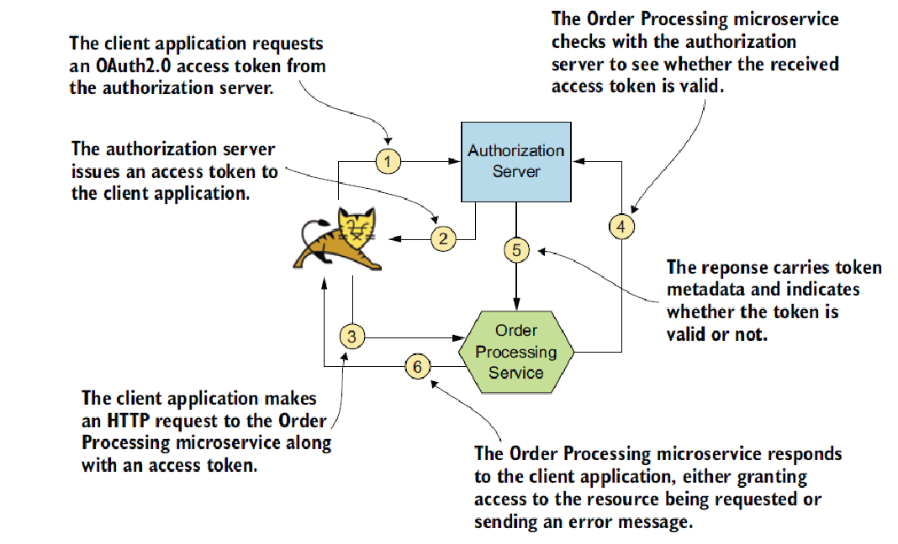
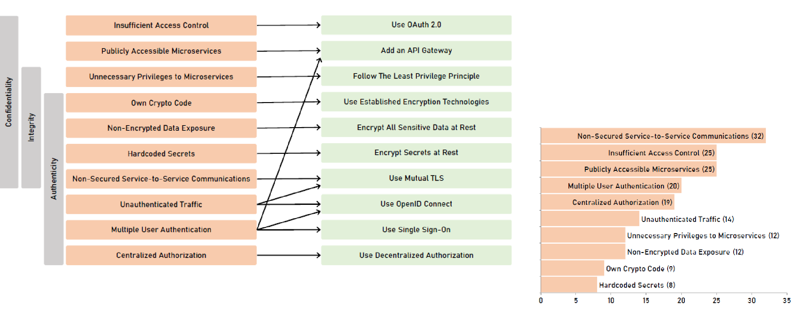

## Multivocal review of white and grey literature

Research questions:

1. What are the most recognised smells indicating possibily security violations in microservice based applications?
2. How to frefactor a microservice-based application to mitigate the effect of a security smells?

58 studies from 2014-20

Result: Taxonomy with

​	10 refactorings associated with

​     	10 smells potentially affecting

​			3 security issues

## Properties

Taken by ISO/IEC 25010 software quality standard

1. Confidentiality
   - degree to which a product or system ensures data access only to authorized entities	
2. Integrity
   - Degree to which a system, product, or component prevents unauthorized modification of computer programs or data
3.  Authenticity
   - Degree to which the identity of a subject or resource can be proved to be the one claimed

**Confidentiality &larr; Insufficient access control &rarr; Use OAuth2**

MIcroservice-based application does not enact access control in some microservices

&rarr; Potential "confused deputy problem" with attacker getting data it shouldn't be able to get

&rarr; Potential violation of confidentiality of data (and business functions)

Client permissions must be verified at request time

Most suggested refactoring: employ OAuth2.0

- token based security framework for delegated access control

- resource owner can grant client access to a resource on its behalf

  

**Confidentiality &larr; Publicly accessible microservices &rarr; Add API Gateway**

some microservices directly accessible by external clients

-> Each such microservice must check authentication and authorization of each request

-  Increased exposure of credentials
  - Increased likelihood of confidentiality violations
- Higher maintenance costs

Most cited solution:add API Gateway

Microservices not directly accessible by external clients

API Gateway can enforce authentication, authorization, throttling, message content validation

**Confidentiality, Integrity &larr; Unnecessary privileges to microservices &rarr; Follow the least privilege principle**

Most cited refactoring:  follow the least privileged principle

**Confidentiality, Integrity, Authenticity &larr; "Home-made crypto code" &rarr; Use estabilished encription technique**

Can also be worse than no encryption (false sense of security)

Solution:

Exploit encryption libraries heavily testes by the community and regularly reviewed/patched

**Confidentialiy, Integrity, Authenticity &larr; Non-encrypted data exposure &rarr; Encrypt all sensitive data at rest**

Microservice based applicat5ion accidentallt exposes sensitive data

Confidentiality and integrity can be violared

Intruders can access/modify data, including credentials

Encrypt all sensitive data at rest(viz, when data is not moving)

- Most DBMS support automatic encryption
- Os supprt disk level encryption
- Application level encryption
- Cached data should be encrypted as well

Encryption resource consuming &rarr; Encrypt only "as needed"

**Confidentialiy, Integrity, Authenticity &larr; Hardcoded secrets &rarr; Encrypt secrets at rest**

Never store secrets in environment variables

- Could be accidentally exposed

**Confidentialiy, Integrity, Authenticity Non-secured service to service communications &rarr; Use mutual TLS**

data exposed to man in the middles, eavesdropping, and tampering attacks

Solution: use mutal TLS, widely accepted solution

**Authenticity &larr;Unauthenticated traffic&rarr; Use mutual TLS, OpenId Connect**

Crucial that microservices can authenticate one another

If not, microservices exposed to security attacks like tampering with data, denial of service, or elevation of privileges

**Authenticity &larr; Multiple user authentication &rarr; Add API Gateway,  Use OpenId Connect, Use single sign-on**

Multiple access points to handle user auth

Each access point potential attack vector

Higher cost of manteinance

Use a single sign-on

- single entry point for user auth
- facilitates log storages and auditing

**Authenticity &larr; Centralized authorization &rarr; Use decentralized authorization**

Authorization can be enforced at the edge of the application and/or by each microservice of the application

If only at the edge

- central auth becomes bottleneck for performance and efficiency

Possibility of "confused deputy problem": microservices trust the gateway based on its mere identity &rarr; potential violation of authenticity

Solution: enacting a decentralized authorization approach

- transmit an access token  together with each request to a microservice
- access to such microservice is granted to the caller only if a know  and correct token is passed

Possible future steps:

- estimating the technical debt caused by security "smells" in microservice-based architectures
- automated support to detect security smells and to recommend refactorings