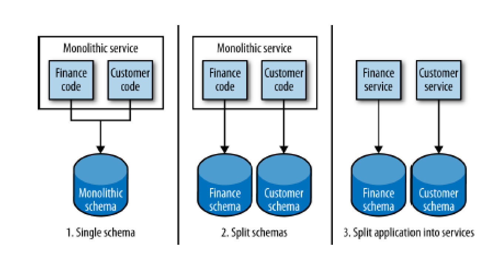

# Splitting the monolith

The monolith grows over time

- New functionalities and lines of code continuously added

- ~~cohesion~~ all sorts of unrelated code kept together

- loose coupling small change can impact rest of monolith, need to redeploy the big beast

> Split the monolith _when_ it becomes a problem

## "Seam"- driven splitting

### Find the "seams"

line where two pieces of fabric are sewn together in a garment

_portion of code that can be treated in isolation and worked on without impacting the rest of the codebase_

**Identify seams that can become service boundaries**

- e.g., exploiting the notion of "bounded context": some info does not need to be communicated outside, some can be shared with other contexts. Cell analogy: membranes define what is in and out and determine what can pass.
- e.g., also exploiting namespace concepts of programming languages (java's packages)

### Example

Online music retailer MusicCorp monolith covers four contexts:

1. Catalog, everything to do with metadata about items offered for sale
2. Finance, Reporting for accounts, payments, refunds, etc.
3. Warehouse, dispatching & returning of custom orders, managing inventory levels etc
4. Recommendation- Patent pending, revolutionary recommendation system

### Organize code around the seams

Create packages representing these contexts, and then move existing code into them

- Incremental refactoring and testing

- Code left over may identify new bounded context

- Use code to analyze dependencies between packages
  - Packages representing bounded contexts in organization should interact like real organization groups (e.g warehouse package should not depend on Finance package if no such dependency in real organization). Tools like <u>Structure 101</u> graphically show inter package dependencies
  
    
  
- Do the above incrementally, really

## Where to start breaking?

Start from where we can get the most benefit

Typical drivers:

- Pace of change (load of changes in inventory management coming, split out Warehouse seam first)
- Team structure (e.g delivery team split across two gepgraphical regions)
- Security (e.g all sensitive information handled by Finance code, additional protection there)
- Technology (e.g team working on recommendation system experimenting new algorithms in Clojure)
- Tangled dependencies (pull out the seam that is least depended on, if possible,e.g look at dependency graph)

## Databases

The mother of all tangled dependencies

Databases often used to integrate multiple services

Need to fnd seams in our database

## Database

Understand which parts of code read from and write to the database.

Detect database level constraints

- e.g, foreign key relationship across tables used by different parts of code

- e.g. use tools like schemaspy

Some tables may be used from different bounded contexts, too

## Database refactoring

### Breaking foreign key relationship

Catalog code uses Line items table to store info on an album

Finance code uses Ledger table to track financial info

To generate monthly reports like "we sold 600 copies of Tones and I's Dance Monkey and made 2,000 USD"

Finance code accesses line items table, and a foreign key relationship from Ledger table to Line items table exists

​										**How to stop Finance code accessing the Line items table?**

Solution: Expose data via API in the catalog package

- overhead introduced (yes)
- foreign key realtionship lost
  - constraint will be managed in the services rather than at the db level
  - may* need to implement consistency check across services, or to trigger actions to clean up related data
    - *choice often not based on technology, e.g. how to handle an order that refers to a catalog ID of an Item that has been removed from the catalog?

### Shared static data

[img]

Solutions:

- Duplicate table for each package (possible consistency challenge)
- Treat this data as code (e.g. config file). Still consistency issues but easier to update config files than set of db tables
- Push static data into a separate service (overkill?)

### Shared mutable data

- Finance code tracks customers payments and refunds
- Warehouse code updates orders dispatched and received
- Both finance and warehouse access Customer record table

Domain concept - Customer  implicitly modeled in db

Solution: create new customer service and make finance and warehouse invoking its API 

### Shared tables

- Catalog needs to store name and price of record we sell
- Warehouse needs to keep electronic record of inventory
- Two concepts stored in same Item table

Solution: store the two concepts separately, split table in two

## What to split first: schemas or services?

Splitting schemas (potentially) increase number of database calls, may break transactional integrity

Splitting schemas but keeping application code together makes reverting changes easier

### Transactions

All-or-nothing transactions are useful, multiple tables updated "at once", always stay in consistent states

- example: when creating a new order
  - order table updated
  - Picking table updated (for dispatching item)
- transactional safety lost with two separate schemas (what if insert order succeeds but insert picking record fails?)

## Solutions

1. Abort entire operation with compensating transactions

   - e.g, if insert order succeeds but insert picking record fails, then start compensating tansaction to undo the committed transaction in the order table, report failure via UI

   - Issues:
     -  where the logic to handle compensating transactions? Customer service, warehouse service, elsewhere?
     - what if compensating transaction fails? (retry)
     - what if we need to enforce consistency of 5 (rather than 2) ops

2. employ distributed transactions
   - transaction manager orchestrates the various transactions being done
   - two phase commit:
     - voting phase: each participant tells manager wether its local transaction can go ahead
     - if transaction manager gets a yes vore i t tells the to go ahead and commit, otherwise it sends a rollback to all parties
   - vulnerabilities:
     - if transaction manager goes down, pending transactions never complete (Single Point Of Failure)
     - if one participant fails to respond during voting, everything blocks
     - What if a commit fails after voting?

3.

- try again later. **Eventual consistency**

## CAP theorem

> In presence of network Partition, you cannot have both availability and consistency

- Consistency: any read operation that begins after  a write operation must return that value, or the result of a later write operation
- Availability: every request received from a non failing node must result in a response
- Network partition: network can lose arbitrarily many messages sent from one group to another

### Netflix approach:

to replicate data in n nodes:

- write to the ones you can get to, then fix it up afterwards"
- use quorum: e.g. (n/2 + 1) of the replicas must respond

**Apache Cassandra**

## The saga pattern

Implement each business transaction that spans multiple services as a _saga_

A _saga_ is a sequence of local transactions

Each local transaction updates a database and triggers next local transaction(s) in the saga

If a local transaction fails then the saga executes a series of compensating transactions

Two ways of coordinating sagas:

- Coreography each local transaction publishes event that triggers nect local transaction(s) in the saga
- Orchestration, an orchestrator tells participants which local transactions to execute

Compensating transaction:

- Backward model undo changes made by previously executed local transactions
- Forward model "retry later"

## REPORTING

### The Reporting database

Reporting typically needs to group together data from across multiple parts of organization in order to generate useful output, e.g.,

- combine data from general ledger with descriptions of sold items from catalog
- combine purchase histories and customer profiles to get behaviour of customers

In monoliths, reports often run on read replica of primary database (performance reasons)

### Reporting on multiple systems:

1. Data retrieval via service calls
   - reporting system pulls data from source systems via API calls
   - does not scale well with large volumes of data
   - exposed APIs may not be designed for reporting (e.g., no way to retrueve all customers)
     - inefficient, may generate load for target service

2. Data Pumps
   - data pushed to the reporting system
   - data pump maps service db to reporting schema
   - coupling worth to pay to make reporting easier
     - data pump should be built & managed by the team managing the service
     - data pump version controlled together with service
   - can be piggybacked by backup operations (Netflix "backup data pumps")

​	

3. Event Data Pumps

- microservices can emit events based on the state change of entities that they manage
  - e.g, Customer service may emit event when a customer is created/updated/deleted
- write event subscriber that pumps data into reporting database
  - no coupling with db of source microservice
  - just binding to events emitted by service(meant to be exposed)
  - event-based flow of data to reporting system faster than periodically scheduled data pump
  - event data pump needs not to be managed by team managing the service
  - drawback: all required info must be broadcaster as events, may not scale well for large volumes of data

## Concluding remarks

Splitting a monolith can be painstaking but

- Planning small, incremental changes makes it easier to understand impact of each change and how to mitigate costs of (unavoidable) mistakes

Growing a service till it needs to be split is completely OK but

- we should understand when it needs to be split - and split it - before the split becomes too expensives
