# Iot Cloud continuum

- Very many data from IoT to Cloud
- Need to filter & process data "before" the Cloud

​	

## So much data, really?

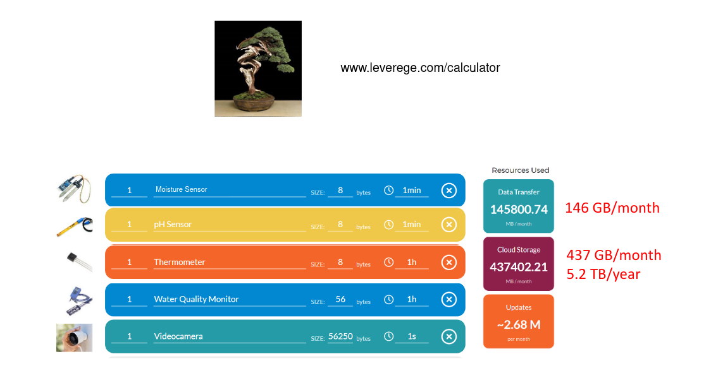

## Deployment models

1. IoT+Edge 

   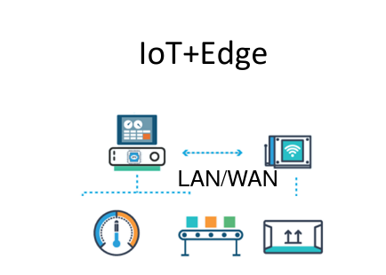

   - Process data in situ at the Edge
   - Low latencies but
   - Limited capabilities
   - Difficulties in sharing data

2. IoT + Cloud 
   
   
   
   - Send data to Cloud for processing
   - Huge computing power but
   - Mandatory connectivity
   - High Latencies
   - Bandwidth bottleneck

## Fog computing

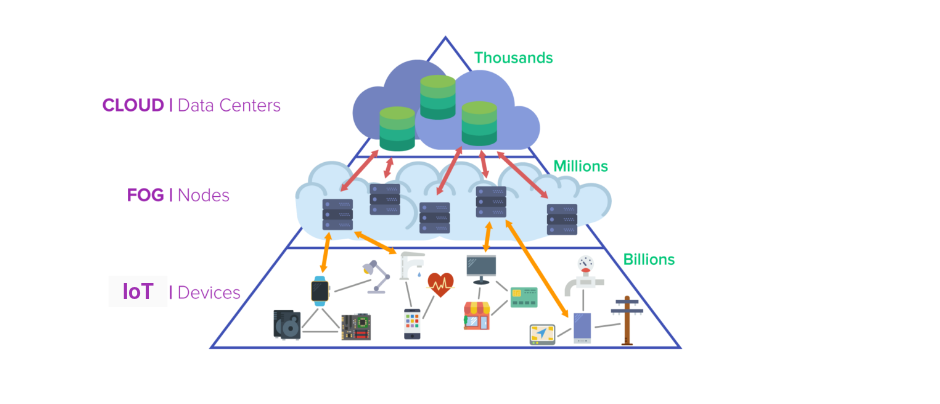

**Fog computing aims at extending the Cloud towards the IoT to better support latency-sensitive and bandwidth-hungry IoT applications**

### Growing industrial & academic interest on fog computing

Many open challenges:

- Adaptive application deployment
- (distributed) application management
- lightweight monitoring
- privacy/security/trust
- fault resilience
- testbeds
- business models
- ...

## Deploying applications through the fog

Deploying composite applications in a QoS- and context-aware manner over the continuum from Things to Cloud..

App requirements:

- Hardware requirements
- Software requirements
- QoS

Fog infrastructure:

- Heterogeneous
- Large
- Dynamic*

**Example**

Simple fog application that manages fire alarm, heating and AC systems, interior lighting, and security cameras of a smart building

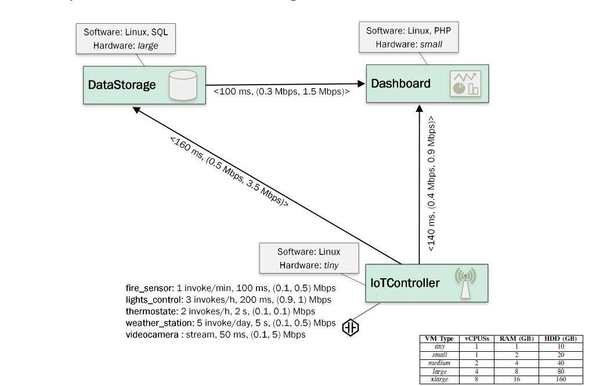

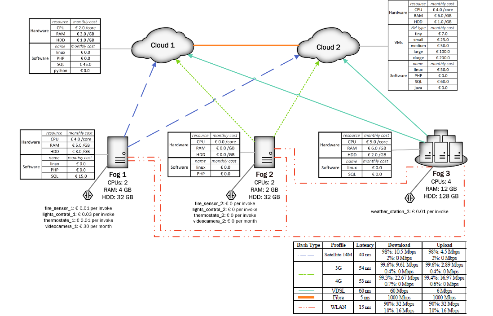

- How to decide _where_ to "best" deploy each component of an application by exploting QOS, location, and context-awareness?

- How to estimate the "goodness" of a candidate deployment?

- Especially challenging for mission critical applications where

  - unpredicatable performances cannot be tolerated

  - limited availability of resources of Fog devices make the management of application deployments intrinsically complex

## Declaratively deploying in the Fog

### Declarative placement

Modelling infrastructure and applications

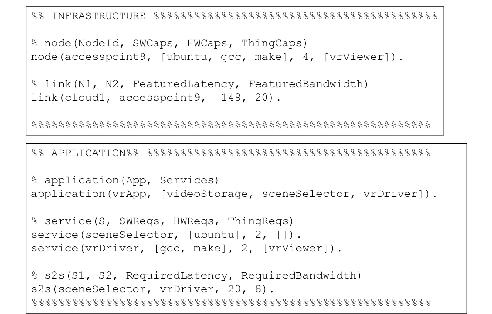

Placing services

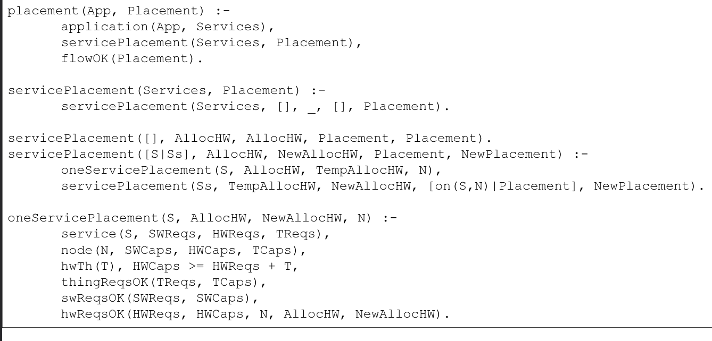

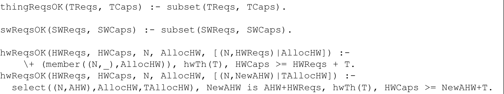

Checking latency & bandwidth constraints

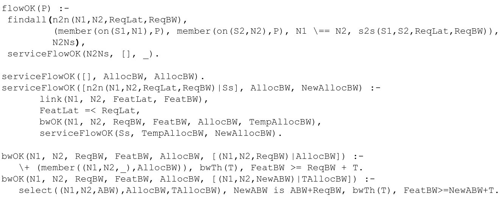

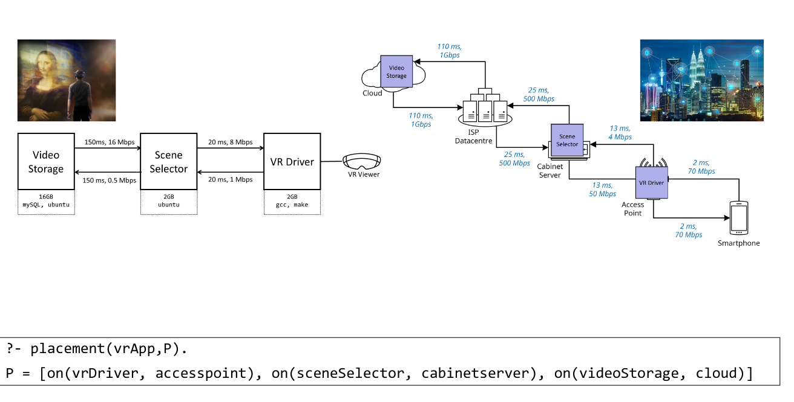

Need to deal with dynamic structures (node may crash, bandwidth may suddenly drops, a new node might be added ecc.)

Probabilistic reasoning &rarr; Problog

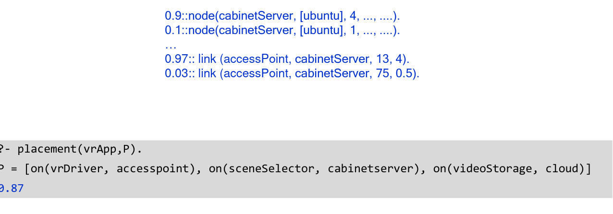