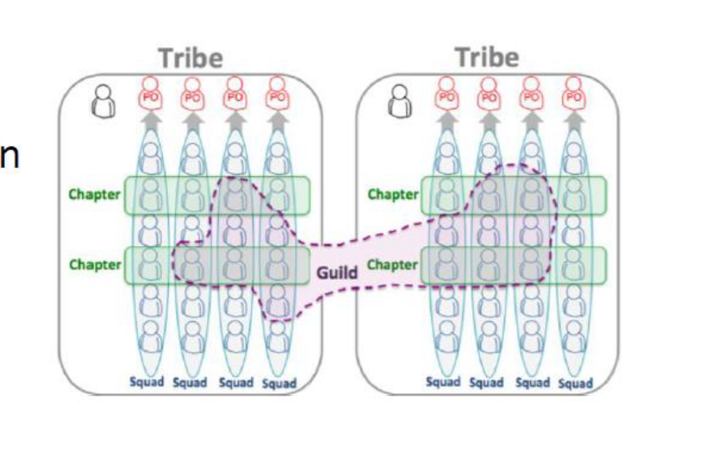

# Microservices: use cases

## Why microservices?

1. Shorten lead time for new features and updates
2. Need to **scale** effectively

### Comparethemarket.com

Uk's most popular insurance price comparison website

Need to change quickly to catch customer trends

8.6m visits/month (October 2021)

### Uber

Need to quickly add & test new services (uber eats, uber elevate, uber freight, uber health ecc.)

95m visits/month (october 2021)

need to scale features individually (search/book/pay)

### Spotify

Need to innovate to compete in fast moving market

Need to support many multiple platforms & different versions

381M active users( october 2021)

25 min avg user session

Agile team organization

- 800+ microservices
- 90+ squads

Engineering culture

- Fail fast &rarr; learn fast &rarr; improve fast
  - failure recovery 
  - fail friendly environment
  - limited bast radius, gradual rollout
- 10% hack time, hack week
- Experiment friendly culture
- Minimize need of big projects
- Improvement boards, Toyota improvement kata

### Netflix

Need to automate and speed up updates

Need to support 1000s of device types

193M paying subscribers

15% of total downstream traffic accross the internet

500+ microservices

Migration to aws

Many tools employed e.g

- Db with eventual consistency
- Ci/Cd
- Fault injection testing (chaos monkey)

## The monolith  strikes back: Why istio migrated from microservices to monolithic architecture

### Istio

Istio provides a uniform way to connect, secure, manage and monitor cloud-native applications deployed in Kubernetes

Data plane: a set of Envoy  proxies deployed as application service sidecars , which mediate and control all communication between application containers

Control plane: five microservices managing and configuring the data proxies. Typically deployed together with a monitoring back end (e.g  Prometeus)

### But.

Negative user feedback

All control plane services were being deployed and used together and shared the same administrative and security domains

​	Hard to draw a sharp line between highly interacting, mutually dependent services

Many benefits of microservices  -  like independent deployability or  horizontal scalability- did not apply to Istio control plane

Cost > benefits, not worth the burden

