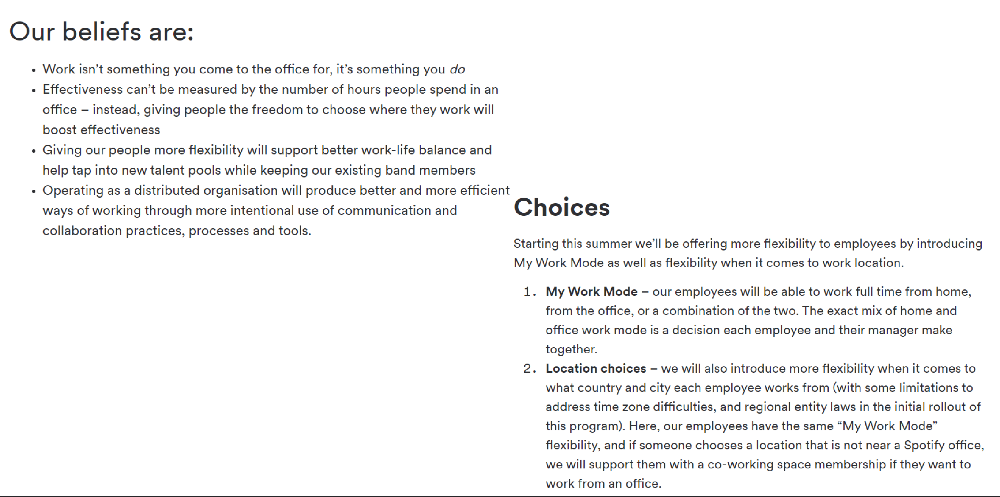

# The hybrid future of [software engineering] work

## Working from home

30,000+ Americans survey

Data say that 20% of full workdays will be supplied from home after the pandemic ends

Reasons

- better than expected WFH  experiences 
- new investments in physical and human capital that enable WFH
- greatly diminished stigma associated with WFH
- lingering concerns about crowds and contagion risks
- pandemic-driven surge in technological innovations that support WFH

Consequences

- Employees will enjoy large benefits from greater remote work, especially those with higher earnings
- Spending in major city centers will reduce by at least 5-10 percent
- 5% productivity boost due to re-optimized working arrangments

## Trends

### Microsoft

Hybrid work paradox: vast majority of employees want more flexible remote work options, but also want more in-person collaboration,post-pandemic

Plan (May 2021)

- Any employee can work remotely up to 50 percent of the time
- Teams rooms innovations
- Reimagine key business processes - from operation to sales

### Google

Plan (may 2021)

- 60% of googlers coming together in the office 3 days of week
- 20%  working in new office locations
- 20% working from home

New spaces

### Facebook

##  SE trends

### Agile working

"work is an activity and not a place "

Agile working is about bringing  people, processes, connectivity and technology, time and place together to find the most appropriate and effective way  of working  to carry out a particular task. It is working withing guidelines (of the task) but without

 boundaries (of how to achieve it).

### New "normality": hybrid work?

Working some days remotely and some days in office with in-person communication

Challenges 

- Ensure timely, on task communication ( also asynchronous) to avoid mismatches among the artifacts
- Minimise dependencies -> software architecting, design thinking -> these  competences  will get more desirable
- Suitable recording decisions' rationale

Opportunies

- More flexibility 
- advantages of remote communication (easier to meet)

Open questions

- Are there unanticipated additional and exasperating hand offs as software engineers shift constantly from remote to in-person mode in a hybrid working model?
- What are the drawbacks of permanent remote-work models?
- How are software developer and engineer productivity and well-being impacted in different models of work?
- Do our oexisting mental models of collaboration and coordination and the tools to support them continue to function in various models of hybrid work?
- What are the potential opportunities for errors and ambiguities that hybrid work models may exacerbate or introduce?
- How can design approaches  that involve  independent  development and deployment  of software elements  further assist new team distribution models?
- Will the mirroring assumptions of software and organization structures, known as Conway's law, still hold with hybrid work models?

## General issues

### Multitasking behaviour during remote meetings

Mutiltasking is a common behaviour in remote meetings, with about 30% of meetings involving email multitasking.

Meeting characteristics (syze, length, type, timing) significantly correlate with the extent to which people multitask

In meeting multitasking during remote meetings can lead to both positive(e.g. improve productivity) and negative (e.g loss of attention) experiences

Tips

- Avoid important meetings in the morning
- Reduce number of unnecessary meetings
- Shorten meetings duration and insert breaks
- Encourage active contribution
- Allow space for positive multitasking 

### Gender differences

Empirical study of remote work during covid 19 on 233 brazilian software engineers(36% women, 74% men)

Two main results:

- Interruptions affecting both men and women
- Organizational incentives addressed men's concerns, but failed to account for women needs

### Other issues

Issues detected by 50+ research projects of the impact of remote working 

- work-life boundary blurred
  - difficult to concentrate because of interruptions
  - feeling less connected
  - increased stress, lower well being

### Legislation and rights

- Can workers choose among in-presence/remote/hybrid?
- new (types of ) contracts?
- Workplaces must offer staff opportunity to work from home as long as there are no compelling operational reasons for doing so
- Employees rights to disconnect

### Why younger workers want hybrid work most

Gen z prefer hybrid work to full remote

Like to have social connection

Want to know and to get known

(Office may be more comfortable than shared flat)

