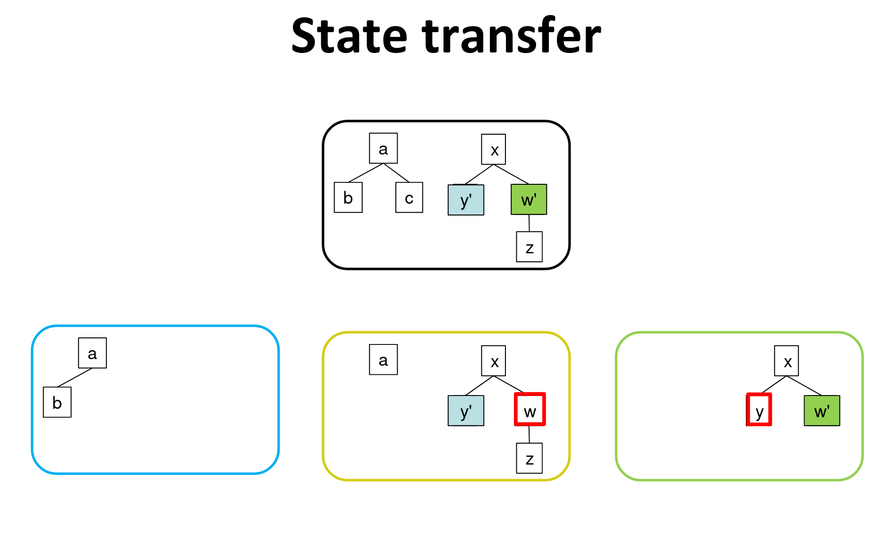
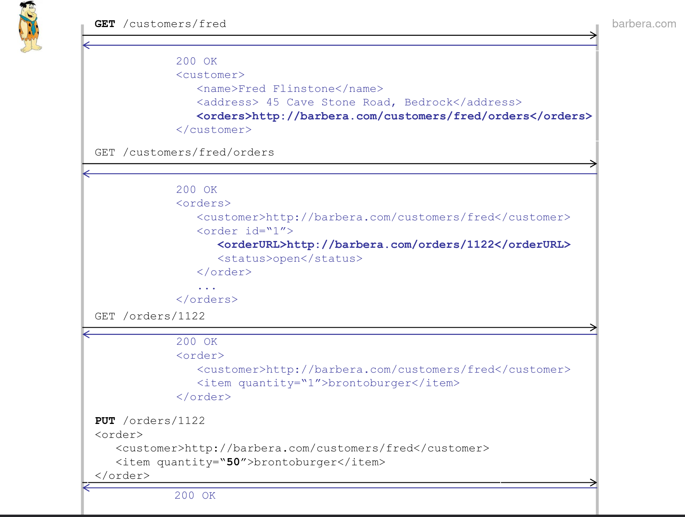
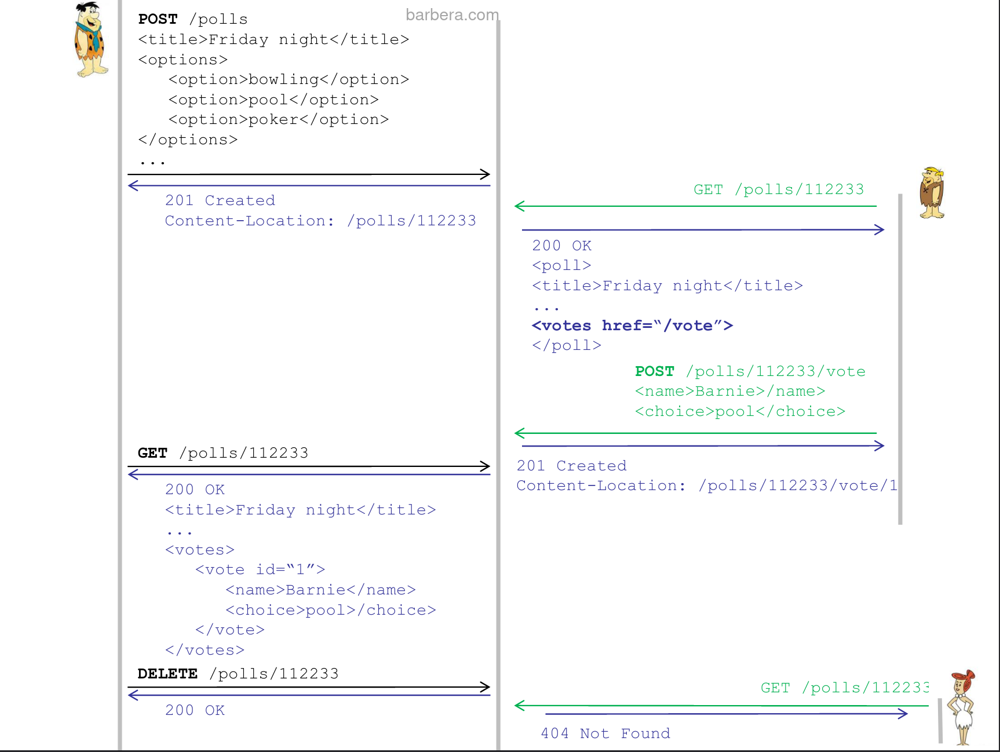
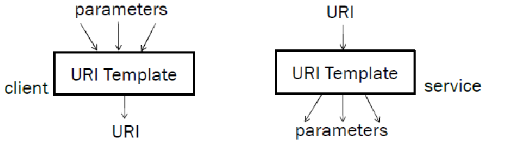
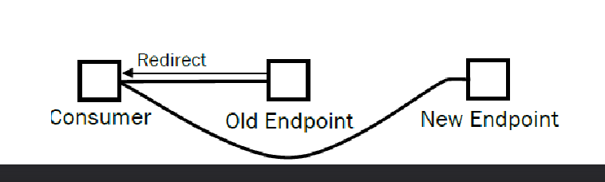
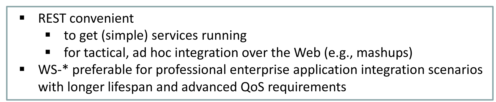

# RESTful services

## What is REST?

> Representational State Transfer 

Originally introduced as an architectural style, developed as an abstract model of the web architecture to guide the redesign and definition of HTTPs and URIs.

*each action resulting in a transition to the next state of the application by transferring a representation of the state to the user*

    

 ## Restful services

 - Services viewed as resources that can be uniquely addressed by their URIs
 - Clients invoke HTTP methods to create/read/update/delete resources
 - REST "resource-centric" (SOAP "message-centric")
 - Requests and responses to transfer representation of resources

## Motivations

- Simplicity
  - rely on few principles and a small set of well defined operations
- Scalability
  - stateless protocol and distributed state
- Layeredness
  - allow (any number of ) intermediaries (proxy, gateways, firewalls)

## REST principles

1. **Resource identification through URIs**
    - Service expose a set of resources  which identify the targets of the interaction  with its clients
    - Resources identified by URIs, which define global addressing space for resource & service discovery 

2. **Uniform interface**
   - Resources manipulated with a fixed set of operations:
     - PUT and POST to create and update state of resources (PUT idempotent)
     - DELETE to delete a resource
     - GET to retrieve current state of a resource

3. **Self descriptive messages**
   - Requests contain enough context information to process the message 
   - **Resources decoupled from their representation**  so their content can be accessed in a variety of formats (HTML, JSON, XML, txt, PDF, JPEG etc...)
   - Metadata used for caching and negotiating reresentation format

4. Stateful interaction through hyperlinks 
    - Every interaction with a resource is stateless
    - No client state on the server, any session state hold on the client
    - Stateful interactions rely on the concept  of explicit state transfer

## Examples 
1. Customer wants to update his food order

    

2. Simple doodle service to organize friday night

    

## Strengths of REST

- Simplicity
  - Low learning curve
    - Rest uses well known standards such as HTTP and the necessary infrastructure is already pervasive
  - Minimal tooling necessary to deploy services
    - Similar to building a dynamic web site
    - no custom client-side software
    - Can begin testing using a simple web browser
  - Because of URIs and hyperlinks we can discover web based resources without complusory registration to a repository

- Efficiency  
  - lightweight protocols and message formats

- Scalability
  - stateless RESTful web services can serve a very large amount of clients

## Weaknesses of REST

- Confusion on best practices
    
    *should i use PUT or POST?*

- No commonly accepted marshalling mechanism, so it's challenging to encode complex data structures in a URI
  
## Designing RESTful services
Design methodology
1. Identify resources to be exposed as services

2. Model relationships between resources with hyperlinks

3. Define «nice» URIs to address resources

4. Understand what it means to do GET/POST/PUT/DELETE for 
each resource (and whether it is allowed or not)

5. Design and document resource representrations

6. Implement and deploy on Web service

7. Test with web browser

URI design guidelines

- Prefer nouns to verbs
        
        GET /book?isbn=24&action=delete
        DELETE /book/24

- Keep URIs short
- Use URI templates to construct and parse parametric URIs
    
- Do not change URIs, use redirection if needed
    

>USE [OpenApi](https://github.com/OAI/OpenAPI-Specification/blob/main/versions/3.1.0.md) SPECIFICATION

## WS-* vs REST

- REST does not have the complexity of the layers of the WS-*stack
- Not wasy to extend RESTful services to support advanced functionalities in an interoperable manner
- Very easy decisions for RESTful  services can cause significant technical risks and development efforts (e.g the design of the specification of resources and URI addressing scheme)
- If the enterprise-level features of WS-\*(transactions, reliability, message-level security) are not required REST adds a lot of flexibility and control at the cost of more low level code, while WS-* provide better tool support and programming interface convenience

