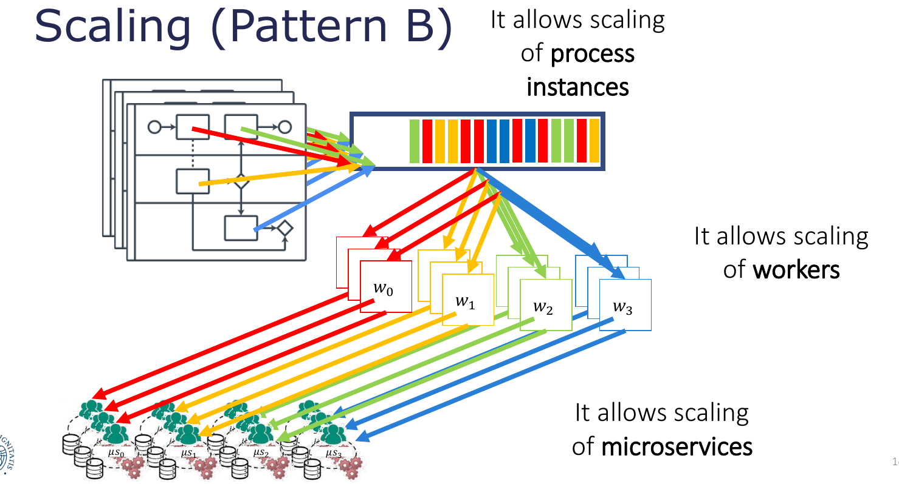

# Questions on the syllabus

<br>

## Contents 

| #  | Question                                                                                                                                                                          | 
| -: | --------                                                                                                                                                                          |
| | **[RESTful Services](#restful-services)**                                                                                                                                            |
| 1  | [How can we create/update/access resources in REST? Which are the pros and cons of REST?](#1-how-can-we-createupdateaccess-resources-in-rest-which-are-the-pros-and-cons-of-rest) | 
| 2  | [What is OpenAPI?](#2-what-is-openapi)                                                                                                                                            | 
| | &nbsp; |
| | **[Microservices](#microservices)** |
| 3  | [Why microservices?](#3-why-microservices) | 
| 4  | [Which are the main characteristics, and the main pros and cons, of microservice-based architectures?](#4-which-are-the-main-characteristics-and-the-main-pros-and-cons-of-microservice-based-architectures) | 
| 5  | [Which refactoring can be applied to resolve architectural smell X? How can we automate the generation of a model of a microservice-based architecture?](#5-which-refactoring-can-be-applied-to-resolve-architectural-smell-x-how-can-we-automate-the-generation-of-a-model-of-a-microservice-based-architecture) | 
| 6  | [What is Flask?](#6-what-is-flask) | 
| 7  | [What is a container/image/volume in Docker? Which are the differences between a virtual machine and a container?](#7-what-is-a-containerimagevolume-in-docker-which-are-the-differences-between-a-virtual-machine-and-a-container) | 
| 8  | [What is the effect of docker build/run/commit? What is Docker Compose?](#8-what-is-the-effect-of-docker-buildruncommit-what-is-docker-compose) | 
| | &nbsp; |
| | **[Software testing](#software-testing)** |
| 9  | [What is development/release/user testing? What is TDD? What is partition testing? What are “software inspections”?](#9-what-is-developmentreleaseuser-testing-what-is-tdd-what-is-partition-testing-what-are-software-inspections) |
| 10 | [What is Locust?](#10-what-is-locust) |
| | &nbsp; |
| | **[User stories](#user-stories)** |
| 11 | [What is a user story? Which are the six main attributes for a good user story?](#11-what-is-a-user-story-which-are-the-six-main-attributes-for-a-good-user-story) |
| | &nbsp; |
| | **[Business process modelling](#business-process-modelling)** |
| 12 | [What is a parallel/exclusive/inclusive gateway in BPMN?](#12-what-is-a-parallelexclusiveinclusive-gateway-in-bpmn) |
| 13 | [What is a workflow net? What is a sound workflow net? What is a live/bounded Petri net?](#13-what-is-a-workflow-net-what-is-a-sound-workflow-net-what-is-a-livebounded-petri-net) |
| 14 | [How can we model BPMN parallel/exclusive/inclusive gateways with workflow nets?](#14-how-can-we-model-bpmn-parallelexclusiveinclusive-gateways-with-workflow-nets) |
| 15 | [What is Camunda? Which are the two “usage patterns” of Camunda?](#15-what-is-camunda-which-are-the-two-usage-patterns-of-camunda) |
| | &nbsp; |
| | **[Security and microservices](#security-and-microservices)** |
| 16 | [Which are the main challenges in securing microservices? Which are the main “smells” in microservices security?](#16-which-are-the-main-challenges-in-securing-microservices-----which-are-the-main-smells-in-microservices-security) |
| 17 | [What is static/dynamic vulnerability analysis?](#17-what-is-staticdynamic-vulnerability-analysis) |
| 18 | [Which are the most frequent API security vulnerabilities?](#18-which-are-the-most-frequent-api-security-vulnerabilities) |
| 19 | [What are authentication and authorization? What are SAML, OIDC and OAuth2.0?](#19-what-are-authentication-and-authorization-what-are-saml-oidc-and-oauth20) |
| | &nbsp; |
| | **[Splitting the monolith](#splitting-the-monolith)** |
| 20 | [When and where to start splitting a monolith codebase? How to split databases?](#20-when-and-where-to-start-splitting-a-monolith-codebase-how-to-split-databases) |
| 21 | [What is the CAP theorem? What is the SAGA pattern?](#21-what-is-the-cap-theorem-what-is-the-saga-pattern) |
| 22 | [What is a (event) data pump?](#22-what-is-a-event-data-pump) |
| | &nbsp; |
| | **[Cloud-IoT Continuum](#cloud-iot-continuum)** |
| 23 | [What is Fog computing? What are (declarative) application placement and continuous reasoning over the Cloud-IoT continuum?](#23-what-is-fog-computing-what-are-declarative-application-placement-and-continuous-reasoning-over-the-cloud-iot-continuum) |
| 24 | [How can we assess the security level of an application deployment? How can we model trust?](#24-how-can-we-assess-the-security-level-of-an-application-deployment-how-can-we-model-trust) |
| 25 | [What is secure FaaS orchestration?](#25-what-is-secure-faas-orchestration) |

<br>

## RESTful services

### 1. How can we create/update/access resources in REST? Which are the pros and cons of REST?

In REST a resource is created/updated/accessed ecc. using HTTP methods.  
Clients invoke methods such as GET, POST, PUT, DELETE and requests and responses are used to trasnfer representaions of resources.  
Rest is resources centric and services are seen as reources that can be uniquely identified by their URIs.

**PROS:**

 - <ins>Simplicity</ins>
   - Low learning curve
     - Rest uses well known standards such as HTTP and the necessary infrastructure is already pervasive
   - Minimal tooling necessary to build services
     - Similar to building a dynamic web site
     - Low effort to build a client for a RESTful service
       + developers can begin testing using a simple web browser
       + no need to create a custom client-side software
     - Because of URIs and hyperlinks we can discover web based resources without complusory registration to a repository
 - <ins>Efficiency</ins>
   - Lightweight protocols and message formats (smart nodes and dumb pipes)
 - <ins>Scalability</ins>
   - Stateless RESTful web services can serve a very large amount of clients

**CONS**:

  - Confusion on best practices
    + Should I use POST or PUT? 
    + Hi-REST (4 verbs) vs. Low-REST (2 verbs)
    + What code should I return? What is the correct URI?
  - No commonly accepted marshalling merchanism, so it's challenging to encode complex data structures in a URI
  - Not easy to extend RESTful services to support advanced functionalities in an interoperable manner
  - Very easy to make decisions on restful services that can cause significant technical risks and development efforts (e.g design of the specification of resources and their URI addressing scheme)
  - Doesn't have the complexity of the layers of WS-* stack
  - Not best suited for enterprise-level services

<br>

### 2. What is OpenAPI?

OpenAPI is a open source specification that is used to describe, produce, consume, and visualize RESTful APIs and web services. 
The OpenAPI Initiative aims at creating a standardized and vendor-neutral desscription format of REST APIs. This format can be used for designing and creating machine readable interface files. 
  
OpenAPI files allow software developers to define their APIs' essentials, including:

- Endpoints and respective operations and actions
- Input and output operation parametes
- Authentication techniques
- Contact information, terms of use, license, and much more

The main advantage of using a standard definition is that thid party users can interact with and understand the service with minimal implementation logic, as long as they are familiar with RESTful APIs basics. 
APIs specifications are either written in YAML or JSON, formats that are readable and easy to understand both for machines and humans.

<br>
<br>

## Microservices

<br>

### 3. Why microservices?

The main two reasons for choosing a microservice architecture are:

- **Shorten lead time for new features and updates**
  + accelerate rebuild and redeployment
  + reduce chords across functional silos
- **More effective scaling (horizontal scaling)**
  + millions of users


<br>

### 4. Which are the main characteristics, and the main pros and cons, of microservice-based architectures?

1. Service orientation:
    - Develop applications as sets of services
      - each service has its own container
      - lightweight communication protocols (REST), can be synchronous (HTTP) or asynchronous (RABBITMQ, REDIS)
      - Polyglot services
2. Organize services around business capabilities
    - Conway's law: "organizations produce designs which are copies of their own communication structures"
    - Agile methods, cross functional teams, flat set of services managed by many teams
    - Different teams with separated roles introduces a delay in communications (context switching)
3. Decentralized data management
    - Each service has its own db, which will be smaller
    - Eventual consistency and compensations instead of distributed transactions
      - We accept some inconsistencies, but they will be consistent some time in the future
4. Independently deployed services
    - Ideally each service should be started without any dependency, should reduce coupling as much as possible
5. Horizontal scalability
    - replicate only services that actually needs the scaling, not the entire application
      - Must be careful when dealing with endpoint based communication with other service (this is a smell, should be addressed with service discovery or a message router)
6. Fault resilient services
    - Avoid cascading failures
    - Must have fault tolerant design
    - Any call can fail for any reason, must handle these as graceful as possible
    - Design for failure (chaos testing, fault injection)
7. DevOps culture
    - You build it, you run it

**CONS**:

- Don't even consider microservices unless you have a system that's too complex to manage as a monolith
- Communication overhead
- Architecture complexity
- "wrong cuts": you may split the monolith wrong, cutting two services that are tighlty coupled, very empirical process
- Very hard to avoid data duplication
- security managment very complex, attack surface broadens (need effective way to handle authorization and authentication)

<br>

### 5. Which refactoring can be applied to resolve architectural smell X? How can we automate the generation of a model of a microservice-based architecture?

#### Rrefactoring

  | **Principle**                 | **Smell**                             | **Solution**                                                                            |
  | ----------------------------- | ------------------------------------- | --------------------------------------------------------------------------------------- |
  | **Independent deployability** | Multiple services in one container    | One service per container                                                               |
  | **Horizontal scalability**    | Endpoint-based service interactions   | Service Discovery (55%) <br> Message Router (31%) <br> Message Broker (14%)             |
  |                               | No API gateway                        | Add API gateway                                                                         |
  | **Isolation of failures**     | Wobbly service interactions           | Circuit Breaker (42%) <br> Timeouts (22%) <br> Bulkhead (20%) <br> Message Broker (16%) |
  | **Decentralisation**          | ESB (Enterprise Service Buses) misuse | Rightsize ESB <br>-> Smart endpoints, dumb pipes                                            |
  |                               | Shared persistence                    | Split databse (50%) <br> Data manager (41%) <br> Merge services (9%)                    |
  |                               | Single layer teams                    | Split teams by services                                                                 |

  **MODEL GENERATION**

To automate the generation of a model of a microservice-based architecture we can use the **&mu;Tosca toolchain**.  
This toolchain allows us to go from incomplete specs for an application to running apps.  
It comprises the following tools:


- **&mu;Miner**:
it allows to mine the architecture of microservice-based black-box apps, only relying on Kubernetes deployment files and monitoring dynamic interactions among microservices of the app. 
It works in 3 steps:
  + Static Mining
  + Dynamic Mining
  + Refinement
- **&mu;Freshner**:
Starting from an app specification, this tool can be used both for editing the specification itself and 
for automatically identifying architectural smells and applying refactorings at the architectural level to solve them.
- **TosKeriser**:
This tool can start from a partial specification of the model of our application, only comprising application components and required software support.
From there it can automatically complete the TOSCA application specifications by discovering and including Docker-based runtime environment providing 
software requirements for every microservice.
  + It uses **DockerFinder** to search for container images based on multiple attributes in remote Docker registries.
- **TosKose**:
This tool allows to automate the deployment on top of existing container orchestrators.
It employs:
  + a _process management_ system inside containers
  + a _service_ for component aware orchestration 
  + a _packager_ capable of deplyoing on existing container orchestrators


<br>

### 6. What is Flask? 

**WSGI** (Web Server Gateway Interface) is a python component created by the Python Web Community to simplify serving HTTP requests.
The problem of WSGI is its synchronous nature: the application stays idle until it gets a response from the service.  
  
**Flask** is a lightweight WSGI web application microframework. 
It is a python module that aims to simplify the development of web-based applications that communicate through HTTP. 
It belongs to the microframeworks ecosystem; microframeworks are a set of tools designed to build Web apps faster.
Micro- here means that: 
- Flask tries to keep its core very simple but modular, with the possibility of adding many plugins and extensions (in fact many exists for different task such as form handling, interaciton with message brokers, testing ecc.). 
- Flask tries to take as few decisions as possible, not enforcing any particular architecture or code style.

<br>

### 7. What is a container/image/volume in Docker? Which are the differences between a virtual machine and a container?

- **Container**  
A sandboxed process on a host machine that is isolated from all other processes on the machine, leveraging kernel namespaces and cgroups (very bound to posix machines). 
It is used to host a lightweight OS stack that supports running a single command on startup. 
This single command can be any program compatible with the OS stack (usually a web app instance).
When this process completes, the container stops.
This startup process can spawn others.  
A container is a running instance of an image. 
You can have multiple contaniners running from the same image.
Containers are created from images, inherit their filesystem and use their metadata to determine their startup configuration.

- **Image**  
A docker image provides the custom filesystem layers that are needed for the isolated process to run (libraries, dependencies, files ecc.) and some metadata. 
A filesystem layer is a collection of changes to files.  
It can be seen as a "programmable" chroot, but a container extends this to not only files but also process resources. 
The image contains everything needed to run the application, and other configuration for the container, such as environment variables, a default command to run, user credentials for a specific service, etc.

- **Volume**  
They are the preferred mechanism for persisting data generated by and used by docker containers.
Data volumes make data persist independently of a container's life cycle. 
When you delete a container, Docker engine does not delete any data volumes. 
Also, volumes are often a better choice than persisting data in a container’s writable layer, because a volume does not increase the size of the containers using it
You can share volumes across multiple containers. 
Moreover, you can share data volumes with other computing resources in your system.

- **VMs** vs. **Containers**  
At a first glance containers look like lightweight VMs.
Actually, they have similare resource isolation and allocation benefits, but work differently because containers virtualize the OS, while VMs virtualize the hw.
So containers share resources with the OS and result to be more lightweight and efficients than VMs.
They also embed dependencies.

| **Containers** | **Virtual Machines** |
| -------------- | -------------------- |
| Containers are an abstraction at the app layer that packages code and dependencies together. | Virtual machines (VMs) are an abstraction of physical hardware turning one server into many servers. |
| Multiple containers can run on the same machine and share the OS kernel with other containers, each running as isolated processes in user space.  | The hypervisor allows multiple VMs to run on a single machine. |
| Containers take up less space than VMs, can handle more applications and require fewer VMs and Operating systems. | Each VM includes a full copy of an operating system, the application, necessary binaries and libraries - taking up tens of GBs. VMs can also be slow to boot. |

<br>

### 8. What is the effect of docker build/run/commit? What is Docker Compose?

- ```docker build```  
builds a new image based on a specification written in a Dockerfile. 
- ```docker run```  
executes a command in a new isolated container created on the basis of a specified image, using the default comand in the image (if it exists) when a command is not provided. 
- ```docker commit```  
creates a new image based on a container's changes to the original image it was built on.
- **Docker Compose**  
Docker Compose is a tool for defining and running multi-container Docker applications.
With a single command one can create and start all the services from a configuration file.  
Using Compose is basically a three step process:
  + Define the app's environment in a _Dockerfile_ so it can be reproduced anywhere
  + Define the services that make up the app in a _docker-compose.yml_ file so that they can be run in an isolated environment
  + Running ```docker-compose up``` will start and run the entire app.

<br><br>

## Software testing

### 9. What is development/release/user testing? What is TDD? What is partition testing? What are “software inspections”?

#### Development / Release / User testing:

1. **Development testing**:  

  It includes all testing activities that are carried out by the team developing the software. 
  The tester is usually the programmer who developed the software, sometimes employing programmer/tester pairs. 
  The testing process can be more formal for critical system, with a specific testing group in the developing team (general trends is agile methods, where there is no separation between testers and devleopers).

  It comprises three stages:

    - **Unit testing**  
      where individual objects, functions or methods are tested. Unit testing should focus only on testing the functionality of these methods and objects.  
      Tests should be designed to call routines with different input parameters and to provide coverage of all the implemented features, putting objects into all possible states.  

      Unit testing should be automated whenever possible. 
      When objects or methods have dependencies on other functionalities one may decide to use mock objects/methods.  

      Unit testing should both:
        + reflect notmal operation of a program, showing how a component works
        + be based on testing experience of where common problems arise

      There are two main strategies that can be effective:
        + Partition testing (see below)
        + Guideline-based testing

    - **Component testing**  
      where several individual units are integrated to create composite components (modules). 
      In this phase we should test the interface that provides access to these functions.
      In fact, interface errors in the composite component may not be detectable by testing individual objects of functions.  
      In this phase one may assume that unit testing has been completed.  

      We can have different types of interfaces among components, but most common forms of interface errors fall into three classes:
        + Interface misuse
        + Interface misunderstanding
        + Timing errors

      Testing for interface defects is difficult beacause some interface faults my only be detectable under unusual conditions.
      Also, interactions between faults in different modules my be detected only when some other module behaves unexpectedly.

    - **System testing**  
      where some or all the components are integrated and the system is tested as a whole. 
      It should focus on interactions between components.  
      This kind ok testing overlaps with component testing, but with two main differences:
        + during system testing reusable components and off-the-shelf systems may be integrated with newly developed components
        + components developed by different team members may be integrated at this stage.

      This is the phase of testing where emergent behaviour of a system should be tested, both wanted and unwanted.  
      Case-based testing is an effective approach for system testing because of its focus on interactions.


2. **Release testing**:  

  It is the process of testing a particular release of a system intended for use outside of development team.  
  There are two important distinctions between release testing and system testing:
    + System development team should not be responsible for release testing
    + The objective of release testing is to ensure that the system meets its requirements and is good enough for external use (validation testing)

  The primary goal is to convince system supplier that it is good enough for use.  
  Release testing is usually a black-box testing process where tests are derived from the system specification.

  There are three main approaches for release testing:

    - **Requirements-based testing**  
      It represents a systematic approach where sets of tests are derived for each requirement.
      This kind of testing approach is validation rather than defect testing.

    - **Scenario testing**  
      In this approach we exploit typical scenarios of use to develop test cases.
      A scenario is a (narrative) realistic story that describes one way the system may be used.
      Typically the same scenario allows to test several system requirements.

    - **Performance testing**
      This approach aims at testing that the system can process its intended workload.
      It is concerned with demonstrating
        + that the system meets its requirements
        + discovering problems and defects in the system

      *Operational profiles* can be employed to test whether performance requirements are being achieved.  
      Performance testing can also include stress testing, which can help with:
        + testing failure bahaviour of the system
        + revealing defects that show up only when the system is fully loaded

3. **User testing**:  

  In this phase of testing users and customers provide input and advice on system testing.
  This form of testing is essential, users real working environment can't be fully replicated but it can impact on reliability/performance/usability of a system.

  Types of user testing:

    - **&alpha; - testing**  
      Users work closely with the development team to test early releases of the software.  
      Users can identify problems and issues that are not readily apparent to the development testing team.

    - **&beta; - testing**  
      The release is made available to a larger group of users, allowing them to experiment and raise problems, that they discovered, to the system developers.  
      Beta testers may be a selected group of customers who are early adopters of the system.

    - **Acceptance testing**  
      Customers test a system to decide whether or not it is ready to be accepted from the system developers and deployed in the customer environment.  
      Acceptance criteria should in principle be part of system contract (in practice requirments change during development).  
      A possible outcome of negotiations can be conditional acceptance, i.e. deploy the system even with problems that need to be fixed.

#### Test Driven Development (TDD):

Test Driven Development is a programming style where software design and implementation are driven by testing. 
You develop the code incrementally, along with a set of tests for that increment.
You don't start working on the next increment until the code that you have developed passes all of its tests.  
Basic steps for TDD are:
1. You identify the increment of functionality that is required
2. You write a test for the new functionality that you want
3. You check that new tests fail (as they should if the functionality was not intended before)
4. You write the code that implements the new functionality
5. You return to testing and verify that they succeed. 
6. You repeat this loop until the test passes. 

This has many benefits including incremental changes, simpler solutions and easy to document functionalities (essentially the test should make clear what the expected inputs and outputs are). 

We also have othe **benefits**:

   - **Code Coverage**: each code segment should have an associated test( not always true, usually a >90% coverage is the ideal target)
   - **Regression Testing**: when adding new code you can re-run all the tests and check that it does not break anything (no spaghetti code!)
   - **Simplified debugging**: it's immediate to see where the problem is
   - **System documentation**: the tests themselves serve as documentation

#### Partition Testing:

Partition testing is a technique used in unit testing to effecitvely test groups of inputs that have common characteristics and should be processed in the same way. 
Tests should be chosen from within each of these groups.  

Basic steps for partition testing are:

  - Identify the groups by using program specification or user documentations and from experience
  - Choose inputs from each groups.  
    _Rule of thumb_: take inputs at boundaries (edge cases) and in the middle (normal cases) of the group.

#### Software Inspection

Software inspections (and reviews) are part of the **SVV** process along with software testing.  
They allow to analyze and check system requirements, desing  models, the program source code and even system tests with the purpose of verifying and validating the system.
They mostly focus on the source code of a system, but any readable representaion of the software can be inspected.

They have three **advantages** over tests:

  - Inspections can discover many errors that during testing may be masked by other errors
  - Incomplete versions of a system can be inspected without additional costs
  - Other than searching for defects, software inspections can also considere broader attributes of a program, such as compliance with standards, portability and mantainability.

Despite all these advantages, inspections cannot replace software testing, since they are **not good for**:
  - discvering defects rising because of unexprected interactions between different parts of a program
  - timing problems
  - problems with system performance

<br>

### 10. What is Locust?

Locust is a open source load testing python tool. 
Being a load testing tool, it allows to understand services bottlenecks under stress, helping developers to determine how to deploy the application and if its design is future-proof in case the load increases.  
It provides a python library and a simple web interface to generate up to a large number of API calls to stress test an application. 
A _locustfile.py_ must be provided in the project root folder, where various user API calls can be defined. 
The number of these calls and their rate can be set via the web interface.

<br><br>

## User stories

### 11. What is a user story? Which are the six main attributes for a good user story?

**User stories** are short, simple descriptions of a desired feature told from the perspective of the person who wants them, usually a user or customer of the system.  
They should contain just enough information for the developers to produce a reasonable estimate of the effort to implement them.  
They typically follow a simple template:

>> As a < type of user >,  
>> I want < some goal >  
>> so that < some reason >.  

User stories are often written on index cards or sticky notes, stored in a shoe box, and arranged on walls or tables to facilitate planning and discussion. 
As such, they strongly shift the focus from writing  about features to discussing them. 
In fact, these discussions are more important than whatever text it is written in them.

**Six main attributes** ( <ins>INVEST</ins> ):

1.  **Independent**: User stories should not have interdependencies between them. Otherwise, they can be difficult to separate by priority, planning and estimation.

2. **Negotiable**: User stories should be flexible and it should be possible to negotiate them in discussions between the customers and the development team during development. Remember that they're short descriptions of features from the user perspective.

3. **Valuable to users**:  user stories must provide descriptions of features that are valuable to end users, and as such should not be focused on technological and programming aspects.

4. **Estimable**: It is essential that the size of a story can be estimated by developers. The better the estimate of story points, the clearer will be their priority and the scheduling of their implementation.

5. **Small**: A good story captures the essence, not the details. Over time the story may acquire notes, details, test ideas and so on, but we don't need these to proiritize or schedule the story.

6. **Testable**: A good story should be testable.
   “Writing a story card carries an implicit promise: I understand what I want well enough that I could write a test for it"

<br><br>

## Business process modelling

### 12. What is a parallel/exclusive/inclusive gateway in BPMN?

| **Gateway** | **Symbol** | **Description** |
| :---------: | :--------: | --------------- |
| Exclusive Gateway |  | When splitting, routes the flow to one outgoing branch. When merging, waits for one incoming branch to complete before triggering the outgoing flow. | 
| Parallel Gateway |  | When splitting, activates all outgoing branches simultaneously. When merging, waits for all incoming branches to complete. | 
| Inclusive Gateway |  | When splitting, activates one or more branches. When merging, waits for all activated incoming branches to copmlete before merging. | 
| Event-based Gateway |  | Followed by catching events or receive tasks and routes the flow to whichever of these happens first. | 

<br>

### 13. What is a workflow net? What is a sound workflow net? What is a live/bounded Petri net?

- **Workflow Net**:  

  Workflow Nets are extensions of Petri Nets.
  They are one of the best known techniques for specifying business processes in a formal and abstract way.
  The idea that brought to Workflow Nets was to enhance Petri Nets with concepts and notations that would ease the represantation of business processes.  

  Petri Nets consist of places, transitions and direct arcs connecting places to transitions. 
  Transitions model activities, places and arcs model execution constraints.
  System dynamics are represented by tokens, whose distribution over the places determines the state of the modelled system.  

  A _state_ M is a distribution of tokens over places.  
  A transition is _enabled_ if and only if each of its input place contains at least one token.  
  A transition can _fire_ if it is enabled.  
  If a tranistion _fires_, one token is removed from each input place and one token is added to each output place.  
  A state M is _reachable_ from a state M<sub>0</sub> if and only if there is a firing sequence of transitions that go from M<sub>0</sub> to M.

  **A Petri Net is a Workflow Net** iff:
  1. There is a unique source place, with no incoming edges
  2. There is a unique sink place, with no outgoing edges
  3. All places and transitions are located in at least one path from the initial place to the final place

- **Sound Workflow Net**:  
  
  A workflow net is **sound** iff:

  1. every net execution starting from the initial state (one token in the source place, no tokens elsewhere) eventually leads to the final state (one token in the sink place, no tokens elsewhere)
  2. every transition occurs in at least one net execution
    
  Like Petri Nets, Workflow Nets focus on the _control flow_ behaviour of a process.
  For this reason, data-dependent choices are modelled as "blind" choices:
    + the analysis may consider more branches than needed, so **lack of soundness** must be interpreted as a warning that prblems may arise at run time.
    + the analysis of an iteration may not determine that the application will never terminate, so **soundness** cannot be interpreted as a guarantee that the application will always terminate its execution.

- **Live/Bounded Petri Net**:  

  A Petri Net (PN, M) is **live** if and only if for every reachable state M' and every transition t, there is a state M'' reachable from M' where t is enabled.  

  A Petri Net (PN, M) is **bounded** if and only if for each place p there is a n &isin; N such that  for each reachable state M' the number of tokens in p in M' is less than n.  

  **Theorem**: a workflow net **N** is sound if and only if  ( **N'**, { i } ) is live and bounded, where **N'** is **N** extended with a transition from the sink place _o_  to the source place _i_

<br>

### 14. How can we model BPMN parallel/exclusive/inclusive gateways with workflow nets?

| **Gateway** | **Symbol** | **Workflow Net** |
| :---------: | :--------: | --------------- |
| Exclusive Gateway |  |  | 
| Parallel Gateway |  |  | 
| Inclusive Gateway |  |  | 
| Event-based Gateway |  |  | 

<br>

### 15. What is Camunda? Which are the two “usage patterns” of Camunda?

#### Camunda

We can desing and implement a set of dedicated, autonomous tasks to do business tasks in our company domain.
Each will have its own business logic and data.  
However, complexity, in modern software systems, lies in collaboration among services.
Everything might easily "fail-fast" when microservices do not manage to properly coordinate.

**Camunda** is a framework supporting BPMN for workflow and process automation, following the orchestration pattern.  
It provides a RESTful API which allows you to use any language for interacting with it.  
Workflows are defined via BPMN and can be graphically modeled using the Camunda Modeller.

#### Usage Patterns

1. **endpoint-based integration**:

  After defining a BPMN process, Camunda can directly call services via built-in connectors.  
  It supports both RESTful and SOAP services in this way.

  

  However, it only allows scaling on process instances, NOT on microservices.

  

2. **queue-based integration**

  This pattern is also called _External Task_.  
  Units of work (tasks) are provided in a Topic Queue. 
  The queue is polled by RESTful workers that can interact with microservices.

  

  This pattern allows scaling of:
    - process instances
    - workers
    - microservices

  allowing to reach overall better results.

  

  Step-by-step functioning:

  

   **Workers philosophy**: don't call us, we call you.  
   You can think of them as "users" involved in the business process.

<br><br>

## Security and microservices

### 16. Which are the main challenges in securing microservices?     Which are the main “smells” in microservices security?

#### Challenges

The main challenges in securing microservices are embedded in the architecture itself. 

  - **The broader the attack surface, the higher the risk**: 
    since we have many services communicating with remote entities, the number of entry points increases (broader surface attack) and the app is as secure as the weakest link. 

  - **Distributed security screening**: 
    each microservice has to carry out independent security screening:
    - May need to connect to a remote security token service
    - repeated, distributed security checks affects **latency and performance**

    Work around: trust-the-network (industring moving to 0 trust policies)

  - **Bootstrapping trust among microservices**: 
    Service to service communicatin must take place on protected channels. Suppose you are using certificates:
    - each microservice must be provisioned with a certificate (and private key) to authenticate itself to another microservice during interactions
    - Recipient microservice must know how to validate the certificate associated with calling microservice
    - Need to bootstrap trust
    - (need also to revoke and rotate certificates)

  Need automation for large scale deployments.

  - **Tracing requests spanning multiple microservices**
    A log records an event in a service. A set of logs can be aggregated to produce metrics

    Traces help you track a request from the point where it enters the system to the point where it leaves the system.

    **Challenging to correlate requests among microserives**.

  - **Containers complicate credentials/policies handling**:
    Containers are immutable servers that donìt change state after spin up.

    But we need to mantain a dynamic list of allowed clients and a dynamic set of access control policies, e.g get updated policies from some policy admin endpoint (push vs. pull model).
    
    Each service must also mantain its own credentials, which need to be rotated periodically, e.g keep credentials in container filsystem and inject them at boot time

  - **Distribution makes sharing user context harder**: 
    User context has to be passed explicitly from a microservice to another. 
    How can we build trust so that a receiving microserrvice accepts an incoming user context? 
    Popular solution: use Json Web Token.

  - **Decentralised security responsabilities**
    Diffenrent teams can use different technlogoy stacks, and this can mean that they use different security practices and tools for static and dynamic analysis. 

    Security responsabilites distributed across different teams.

    Usually hybrid approach with centralized security team.

#### Smells

**Properties**:

  - **Confidentiality**: degree to which a product or system ensures that data are accessible only to those authorized to have access
  - **Integrity**: degree to which a system, a product, or component prevents unauthorized modification of computer programs or data
  - **Authenticity**: degree to which the identity of a subject or resource can be proved to be the one claimed
  

| **Property**                                     | **Smell**                                        | **Solution**                                        |
| -----------------------------------------------: | ------------------------------------------------ | --------------------------------------------------- |
| Confidentiality                                  | Insufficient access control                      | Use Oauth 2.0                                       |
| Confidentiality                                  | Publicly accessible microservices                | Add API gateway                                     |
| Confidentiality <br> Integrity                   | Unneccesary privileges to microservices          | Follow the least privilege principle                |
| Confidentiality <br> Integrity <br> Authenticity | Home-made crypto code                            | Use established encription techniques               | 
| Confidentiality <br> Integrity <br> Authenticity | Non encrypted data exposure                      | Encrypt all sensitive data at rest                  | 
| Confidentiality <br> Integrity <br> Authenticity | Hardcoded secrets                                | Encrypt secrets at rest                             |
| Confidentiality <br> Integrity <br> Authenticity | Non secured service-to-service communications    | Use mutual TLS                                      |
| Authenticity                                     | Unauthenticated traffic                          | Mutual TLS <br> OpenId Connect                      |
| Authenticity                                     | Multiple user authentication                     | Api Gateway <br> OpenId Connect <br> Single sign-on |
| Authenticity                                     | Centralised authorization                        | Decentralise authorization                          |

<br>

### 17. What is static/dynamic vulnerability analysis?

**Static vulnerability analysis** is a type of white box analysis that has full access to the source code. 
It uses static analysis techniques to find known security vulenrabilities that are caused by the code itself (e.g hardcoded secrets, old libraries with known vulnerabilities, bad crypto practices). 


**Dynamic vulnerability testing** is a black box analysis. 
It tries to break the security control and find vulenrabilities by calling multiple applications API endpoints. 
Its purpose is to find bad designed authentication and authorization policies by exploiting a running application behaviour. 
It can find vulnerabilities such as no CSRF token, XSS, code injection problem, security misconfigurations, unneccessary data exposusre ecc..  

It can involve **penetration testing**, a process of testing a system, network, or web application for vulnerabilities that could be exploited.  
It can be performed as:
  - **passive scan**: a harmless can that looks only for responses anche checks them against known vulnerabilities
  - **active scan**: a practice that tries to deliberately penetrate the system by using known techniques to find vulnerabilities.

<br>

### 18. Which are the most frequent API security vulnerabilities?

| **API Security Vulnerability**      | **Solution**                                                                                                                                   |
| ----------------------------------- | ---------------------------------------------------------------------------------------------------------------------------------------------- |
| Broken object-level authorization   | Use random ID for your objects                                                                                                                 |
| Broken authentication               | Use standard authentication, token generation, password storage, multi-factor authentication                                                   |
| Excessive data exposure             | Not expose system technologies <br> Error shielding                                                                                            |
| Lack of resources and rate limiting | Proper resource and rate limiting                                                                                                              |
| Broken function-level authorization | Use OAuth2.0 scopes                                                                                                                            |
| Mass assignment                     | Don't automatically bind incoming data and internal objects                                                                                    |
| Security misconfiguration           | Automated process to locate configuration flaws                                                                                                |
| Injection                           | Validate, filter, sanitize all incoming data                                                                                                   |
| Improper assets management          | Inventory all API hosts                                                                                                                        |
| Insufficient logging and monitoring | Employ a system to analyze process behavioural data <br> and user behaviour through logging to find abnormalities <br> and suspicious patterns |
    
<br>

### 19. What are authentication and authorization? What are SAML, OIDC and OAuth2.0?

#### Authentication

Authentication is the **act of confirming the truth** of an attribute of a single piece of data or entity (user of an application, for instance).

In the digital world we tend to simplify the confirmation by using **username and password** (the assumption is that password is known only by the intended user, so specifying the right password you're demonstrating you actually are who you pretend to be).

#### Authorization

Authorization is the function of **specifying access rights** to resources related to information security and computer security in general and to access control in particular.  
Formally, "to authorize" is to define an access policy.
      
In the digital world, defining the access rules user by user can be impractical.  
Authorization is often implemented with the so called **Role-Based Access Control** (RBAC).
  - users are pooled in groups based on their organizational role (e.g payroll manager, project group A, ...)
  - access rights are then asssociated to roles
      
When a user access an application:
  - authenticates himself / herself
  - activate one or more roles (depending on the groups of belonging)
  - access services by leveraging RBAC authorization

#### SAML

SAML (Simple Assertion Markup Language) is a **standard** that **facilitates the exchange of security information**. 
It is an XML-based framework that enables different organizations (with different security domains) to securely exchange authentication and authorization information.

To create a SAML infrastructure:
  - an Identity Provider (IdP) must be **installed on top of each organization directory** to permit user authentication in the federation
  - a Service Provider (SP) must be **installed on top of each application** to consume authentication and authorization information obtained from the federation.

#### OIDC

OpenId Connect (OIDC) is a **standard** that **facilitates the exchange of security information**. 
OIDC is a framework that uses REST APIs and JSON format. 
OIDC enables different organizations (with different security domains) to securely exchange authentication and authorization information.

To create an OIDC infrastructure:
  - an openID Provider (OP) must be **installed on top of each organization directory** to permit user authentication to the federation (similarly to IdP in SAML)
  - a Relying Party (RP) must be **installed on top of each application** to consume authentication an authorization information obtained from the federation (similarly to SP in SAML)

Both SAML and OIDC can be used to federate an application.

#### OAuth2.0

OAuth 2.0 is an IETF standard for authorization. 
OAuth2 defines a mean to represent the authorization granted to the third party, the _access token_, and a set of flows and mechanisms to:

  - obtain the authorization, that is the access token
  - convey the authorization to a third-party application
  - use the authorization on a protected resource
  
All on top of the HTTP protocol
  
**OAuth2.0 Actors**:
  - **Resource Owner** (RO): the granting access entity, usually the user and his User Agent
  - **Resource Server** (RS): the server hosting the resource to be accessed (e.g. an API)
  - **Client**: the application to which the grant is entitled (a web app, a desktop app, a mobile app, a javascript-on-top-of-user-agent app, ...)
  - **Authorization Server** (AS): registers clients, authenticates users, and issues access tokens.

**Access token**  
A sring representing an authorization issued to the Client (for which is usually opaque). 
<ins>OAuth 2.0 does not mandate the format nor the content of the access token</ins>
      
**Refresh token**  
Credentials used to obtain access tokens when the current access token becomes invalid or expires.
      
**Scopes**  
Set of rights delegated to the client on the Resource Server - expressed as a list of space-delimited, case sensitive strings.
    
**Protocol Endpoints**:
  - Authorization endpoint (Authorization Server)
  - Token endpoint (Authorization Server)
  - Redirection Endpoint (Client)\[<ins> SHOULD require the use of TLS by RFC 6749 </ins>\]
    
**OAuth 2.0 Flows**:
  - <ins>Authorization Code Grant</ins>  
    It is the main flow to obtain an access token, and mainly targeted to web applications.
    - client authentication
    - employ an intermediate authorization phrase represented by an authorization code
    - The access token is exchanged without the involvment of the Resource Owner User Agent

    

  - <ins>Implicit Grant</ins>  
    A simplified authorization code flow optimized for clients implemented in a browser.
    - No client authentication
    - No intermediary code to obtain the access token
  
    

  - <ins>Resource Owner Password Credentials Grant</ins>  
    It is a flow for highly trusted clients:
    - the resource owner credentials are used directly by the client to obtain an authorization

  - <ins>Client Credentials Grant</ins>  
    It is a flow for third party Clients with very limited access to resources
    - it is based on client credentials only

<br><br>

## Splitting the monolith

### 20. When and where to start splitting a monolith codebase? How to split databases?

#### When and where

- **When**  
  We must start considering to split a monolith only when it becomes a problem.  
  How to define when it becomes a problem is context dependant but there are some useful indicators:

    - Codebase has fast pace of change and functionalities are continously added
    - The codebase becomes too big to be managed as is (fear of touching the code)
    - A lot of code kept together is unrelated
    - Loose coupling impact performance and maintenance, monolith has always to be deployed all together

- **Where**:  
  Find the seams: portions of code that can be treated in isolation and worked on without impacting the rest of the codease.
  We also want to identify the seams so that they can become service boundaries.  
  Bounded contexts make excelent seams, because by definition they represent cohesive and loosely coupled boundaries in an organization.

  At this point, exploiting the notion of software modules we can create packages representing the bounded conexts we found and move existing code (refactor it!) into them.
  This process can be (and _should_ be) done <ins>incrementally</ins>.  
  While doing this, some code could be _left over_, not fitting well anywhere.
  This remaining code might identify bounded contexts previously missed.

  Which context to move first depends on the application and the motivations for splitting it.  
  Typical drivers can be:
    - Pace of Change
    - Team Structure
    - Security
    - Technology
    - Tangled Dependencies

#### How to split the database

To split the database we need to find the seams inside of it. 
First of all, we need to understand which parts of the code read to and write from the database.  
Having the database mapping code colocated inside the code for a given context can help us undestand what parts of the code are mapped to what parts of the database.  
But this doesn't give the whole story: there might be constraints enforced by the database itself, e.g. foreign key relationships from a table to another.

Concrete examples:

  - **Breaking foreign key relationship**  
    Services could use infos from other services via database foreign keys.  
    A possible solution can be to expose data via API calls in the checked service package.  
    This can cause more overhead and the foreign key relationship is lost. 
    This means that constraints must be managed at the service level. 
    We need to implement consinstency checks.

  - **Shared static data**  
    To address this case there are three possible solutions:
    + Duplicate tables, which could cause possible consistency problems
    + Treat data as code, i.e. config files.  
      It's easier to update config files than database tables even with consistency issues.
    + Expose static data as a separate service.  
      This solution may be an overkill.

  - **Shared mutable data**  
    In most cases the best solution is to move shared data in a new service that can be invoked through API calls, making concrete a concept that was previously abstract and only present in the databse.

  - **Shared tables**  
    In this case the best solution is to split the table in two, moving used contexts to each service needing it and storing two concepts separately.

The last step while splitting the database is staging the actual break.  
It is best to split database schemas right after code refactoring into packages but before splitting the monolithic service into microservices.
This because from one to more separate schemas we potentially increase the number of database calls to perform a single action and we also end up breaking transactional integrity.  
By splitting the schemas while keeping the application together we give ourselves the possibility to revert or tweak changes as needed.

<br>

### 21. What is the CAP theorem? What is the SAGA pattern?

#### CAP Theorem
**Theorem**: In presence of a network partition, you cannot have both availability and consistency.

  + **Consistency**: any read operation beginning after a write operation must return that valure or the result of a later write operation
  + **Availability**: every request received from a non-failing node must result in a response
  + **Network partition**: network can lose arbitrarily many messages sent from one group to another


#### SAGA Pattern

A pattern to implement distributed transactions in a lightweight manner.  
It consists in implementing each business transaction spanning multiple services as a saga.  
A **saga** is a sequence of local transactions. 
Each local transaction updates a database and triggers next local trnasactions in the saga.
If one local transaction fails then the saga executes compensating transactions (rollback).

Two ways to coordinate sagas:
  + **Coreography**: each local transaction publishes an event that triggers next transactions in the saga
  + **Orchestration**: an orchestrator tells participants which local transactions to execute

Compensating transactions:

  + **Backward model**: undo changes made by previously executed local transactions
  + **Forward model**: retry later (possibly with timeouts and circuit breakers)

<br>

### 22. What is a (event) data pump?

Data pumps are needed to keep updated the reporting database, which is usually kept as a separate copy of the main database. 
They offer a good alternative to retireving data for the reporting database through HTTP calls, reducing the overhead of both HTTP itself and of having APIs that may exist only for reporting purposes.  
Reporting database can be challenging to update when we have multiple databases. 
When the database is updated, data is pushed to the reporting systems (possibly in bulks and not after each individual transaction).

- **Normal data pumps**  
  They are implemented with a standalone program that directly accesses the database of the service (the source of the data) and pumps it into a reporting database, mapping the service database to the reporting schema.  
  Having multiple programs integrating on the same database is a bad practice. 
  This case, though, is a good exception since downsides of coupling are balanced by making the reporting easier.  
  The data pump should be built and managed by the team managing the service (and the relative database).
  It should also be version-controlled together with the service to avoid issues.

- **Event data pumps**  
  When we have microserives that emit events based on the state change of entities they manage, we have the option of writing an event subscriber that pumps data into the reporting database.  
  In this case we avoid the coupling on the database of the source microservice.
  This time we just bind to the events emitted by the service, which are designed to be exposed to external consumers.  
  We can also send data to the reporting database as events occur, allowing data to flow faster to the reporting system, rather than relying on scheduled data pumps.  
  This kind of data pumps can also be managed independently from the microservice, given their less coupled nature.  
  If we store which events have already been processed, we can make new insertions more efficient, only sending deltas to the reporting database.  
  The main drawback is that all the required informations must be broadcast as events and this may not scale well as a regular data pump for larger volumes of data.

<br><br>

## Cloud-IoT continuum

### 23. What is Fog computing? What are (declarative) application placement and continuous reasoning over the Cloud-IoT continuum?

#### Fog Computing

Fog computing is a computing paradigm that was proposed in order to overcome the emerging limitations of IoT.  
IoT allows for new interesting applications like domotics, automatic transport, drone fleet and delivery, visual security, smart cities, etc.  

The main problem is that there are al lot of IoT devices.
In addition to that, the amount of data generated by each of these devices is huge and the cloud is not expected to hold the IoT momentum.
Moreover, some of the presented applications have some precise QoS requirements that cannot be provided in an only cloud based interaction.  

The idea of fog computing is to fill the gap between data centers and IoT with one or more intermediate computation layers populated by fog nodes, which act as filters towards the data centers and as a physically close endpoint for latency sensitive applications.  
In this sense, Fog Computing aims at extending the Cloud towards the IoT to better support **latency-sensitive** and **bandwith-hungry** IoT applications.  
This way the best of the cloud and edge deployment models are both kept.  

The main points allowed by this paradigm are:
- Low latencies and bandwith savings
- Geo-Distribution
- Collaboration between fog nodes
- Hetetogeneity of devices
- Mobility support
- Location and Context awareness

#### Declarative Placement

App deployment becomes a very complex problem (NP Hard) in a Fog context. 
Also, it requires deploying composite applications in a QoS- and Context-aware manner over the Cloud-IoT continuum.  
You have a set of App requirements (Hardware, Software, QoS) on one side and a Fog infrastructure (Heterogenenous, Large, DYnamic) on the other side.

Challenges:

- How to decide where to _best_ deploy each component of an application by exploiting QoS-, location-, and context-awareness?
- How to estimate the _goodness_ of a candidate deployment?
- Especially challenging for mission critical applications.

A solution is to convert the problem to a *declarative problem*. 
You use a specific syntax to declare what constraint you want to satisfy and you let an automatic solver find all the possible *placements*.  
We can model requirements as predicates and use Prolog.  
You describe what you want in the solution, NOT how to achieve it.

A problem with this approach is the fact that fog structures are dynamic, so we need to handle redeployments in the presence of 
- changes in the infrastructure
- changes in the services
- addition or removal of services or service-service communication requirements

Redeploying the entire system at any change is going to be too complex (NP Hard problem, exp worst time cost) and a waste of resources since we don't need to change placements not affected by the changes.

We can solve this issue with continous reasoning.

#### Continuous Reasoning

Continuous reasoning is a technique inspired by approaches like CI/CD pipelines and usually used in software enginnering to differentially analyze changes in large-scale systems by exploiting compositionality. 
We mainly focus on latest changes and reuse computed results as much as possible (e.g FB Infer, works on diff and not the entire source code all the time).

All in all this approach gives two big benefits:
- it's declarative
- it features scalability by supporting application maangement decisions at large scale

Continuous reasoning for application placement is useful for:

  - Scale to larger instances of the placement problem
  - Reduce time needed to make placement decisions at runtime
  - Possibly reduce the number of management operations needed to adapt the current deployment (stop, undeploy, deploy, start)

How can we do this?  
Re-deploying only services affected by infrastructure and CI/CD changes, when they are already deployed and it is possible to find a partial re-deployment.
If we are facing a first deployment or it's not possible to re-deploy only new services and those affected by changes, a whole new deployment is needed.

<br>

### 24. How can we assess the security level of an application deployment? How can we model trust?

#### Assess security of an application deployment

Enforcing security in a fog context can be quite challenging. 
A fog architcture increases the attack surface by exposing a lot more possible entry points and shares a lot of the threats with cloud computing (enforciing isolation, man in the middle ecc.).  
It is also exposed to more peculiar threats because fog nodes are physicially accessible (social engineering, access security in place ecc.)

We can use a **declarative approach** for security as well.  

We first define a **taxonomy** of possible secruity measures that a Fog infrastructure can enforce. 
This ranges from mitigation measures for software vulnerabilities, access and communication control , sensitivie data control, Physical security ecc.

Fog infrastructure is managed by multiple **infrastructure operators**. 
Indeed a fog deployment span various service providers. 
To manage and assess security we assume that each node self-describes its capabilities and effect against attacks with a node descriptor that uses the taxonomoy we described. 
This allows us to have a complete view of the available security capabilities.  
This can be done in a declarative way simply stating a set of facts declaring the node security capabilities.

On the other hand we have an **app operator** that describes the app topology and its security requirements both at the component and application level leveraging on the taxonomy.  
Security requirements can be desscribed with custom security policies in terms of default security policies specified by the model (in this case SecFog). 
The app operator can also specify complete and partial deployment of application and the trust degrees towards different infrastructure operators.  
This constitute the security requirements of the multi component app. 

#### Generate & Test Strategy

We expoit a reasoning engine (ProbLog) that takes as input the security requirements from the application and security capabilities from the infrastructure and can be used both:
  - to determine (or complete) secure application deployments, assesing their security level
  - to assess the security level guaranteed by complete input deployments

In both cases the engine outputs (possible) deployments annotating them with a quantitative security assessment.

#### Modeling trust

We build a trust network where operators are nodes and directed arcs between them are annotated with the associated trust level (opinions). 

In the default trust model:

- opinions along paths are combined via multiplication
- opinions across paths are combined via addition

Limitation in the default model:

1. It is **monotonic**, all paths toward a provider increases trust degree towards it
2. It is **unconditionally transitive** (if A trusts B and B trusts C &rarr; A trusts C)

We can use more sophisticated models using semirings.

#### Commutative semiring

A commutative semiring is an algebraic data structure consisting of a 5-tuple:

&nbsp;&nbsp;&nbsp;&nbsp;(S, &oplus;, &otimes;, 0, 1)

where S is a set of elements and &oplus; and &otimes; are two binary operators defined over S such that:

- &oplus; is commutative and associative, with 0 as its neutral element
- &otimes; is associative, distributes over &oplus; and 1 and 0 are its neutral and absorbing elements, respectively

Assuming that &Omega;(q) is a set of possible worlds W that entail a valid proof for a certain query q:

&nbsp;&nbsp;&nbsp;&nbsp;&Omega;(q) = {W | W &models; q}

ProbLog computes the probability p(q) that q holds in the following ways:

| **Probability Semiring** | **Generic Semiring** |
| ------------------------ | -------------------- |
|  |  |

**A different trust model**


This is a non monotonic and optimistic model. 
A pessimistic model takes the minimum instead of the maximum.

#### Conditional transitivity

We can limit transitivity to a radius.  
As an example, if we pick a radius of 3, an operator transitivitely trusts only the next three operators along a path in the trust network.

### 25. What is secure FaaS orchestration?

**FaaS** stands for **Functions as a Service** and it's the more recent cloud computing model.  
In this model, a platform is provided to define stateless, event-triggered functions. 
A user provides the code of the function, the trigger and how to handle the results. 
There is a total abstraction from the target deployment stack and the underlying infrastructure is not specified by the end user. 
This allows a simplified deployment for event-driven and stateless applications, resulting in a model with very low execution costs. 
Particularly suited for IoT data computation 

| **Pros**          | **Cons**                 |
| :---------------- | :----------------------- |
| Costs             | Cold starts              |
| Scalability       | No persistent state      |
| Productivity      | Non concurrency controls |
| Avgerage latency  |                          |

#### FaaS meets Cloud-IoT Continuum
Key Idea: deploy functions on nodes near the edges.

- Improve QoS of FaaS
- Event Driven Programming
- Better resource management

But this rises non trivial security problems.

#### Security issues:
- Reduced Trust Computing Base
- Devices can be easily hacked, stolen, or broken
- Isolate users to calculate accounting and billing
- Privacy

#### FaaS + C-I continuum + Security
This combination has applications for:

- Environmental monitoring
- Diseases tracking
- Home automation
- Vocal assistants
- Smart agriculture

#### Three Perspectives:
- Defining FaaS orchestrations
- Executing FaaS  orchestrations in the C-I continuum
- Securing FaaS orchestrations

#### P1: Define FaaS orchestration

Findings on languages, models, and methodlogies to define FaaS orchestrations:

- High support for basic programming constructs (sequential, conditonal branches, loops...)
- Direct triggers vs publish/subscribe invocation
- Recursive functions supported (but not particularly liked)
- Low support for type checking functions

#### P2: Executing FaaS orchestrations  in the C-I continuum

Findings on platforms, techniques and methodologies to execute FaaS orchestrations in the C-I Continuum:

- High support for latency and resource management
- Cost-awareness has good consideration
- Data- and bandiwth-awareness considered by few works

#### P3: Securing FaaS orchestrations

Findings on techniques and methodologies to secure FaaS orchestrations both statically and at runtime:

- Data confidentiality and function integrity are the main assets protected
- The main threat is given by external attacks, but also cloud providers and developer mistakes are highly considered 
- The main protection techniques are hardware isolation and information flow security

#### Research challenges

- **P1 &cap; P2** (Definfing FaaS orchestrations &cap; Executing FaaS orchestrations in the C-I Cont )

  - Orchestration aware execution:  
    Exploit orchestration to place and execute functions (instead of considering single functions).
  
  - Definition and Execution of context-aware and Qos-aware orchestration:  
    Add context  and QoS requirements to functions and orchestrations to support placement and execution.

- **P1 &cap; P3** (Defining FaaS orchestrations &cap; Secure Faas Orchestrations)

  - Definition of security requirements:  
    Add to function orchestrations security requirements on functions (e.g specific nodes execution), orchestrations (e.g policies defined on set of functions), and data (e.g defining and exploiting security levels).
  
  - Static analysis of FaaS orchestrations:  
    Analyse statically defined FaaS orchestrations using the afromentioned requirements to support placement and execution.

- **P2 &cap; P3** (Executing FaaS orchestrations  in the C-I cont. &cap; Securing FaaS orchestrations)
  - Secure executions in the C-I Continuum:  
    Scpecific approaches to security of FaaS, e.g. information flow control security of functions and orchestrations in the C-I Continuum.

#### Placing FaaS in the Fog Securely

QoS-, security-, trust-aware placement of FaaS orchestration can be achieved through:

- FaaS orchestration + data security levels
- C-I infrastructure + security capabilities
- Security policies + trust network

**FaaS2Fog** is a methodology and &alpha;ProbLog prototype to place orchestrated FaaS applications onto C-I Infrastructure, securely. 
It features:

- Declarative model
- Hw, Sw, Latency constraints
- Infrastructure and IF security and trust

Security is measured and enforced with a similar approach to SecFog (declarative approach based on a trust network).

Given a chain


and an infrastructure


deploying the chain onto the infrastructure requires satisfying all functions' software, hardware and latency requirements and determining a suitable binding from functions to the service instances they need.  
Furthermore, function labels and node labels should be compatible, i.e. a node can host a function only if it features an equal or higher security label.

#### How it works

Given a function chain, FaaS2Fog can output a placement in two main steps:

- **Security type propagation through the chain**:  
  by scanning the list of chained functions, the process instantiates the security type of all parameters and then assigns to each function the highest security type among the security labels of its parameters.

  

- **Mapping of typed functions onto the C-I infrastructure**:  
  the process scans the list of typed functions and determines an eligible placement for each of them.
  
  

