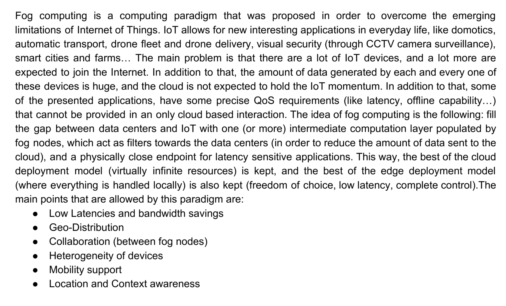
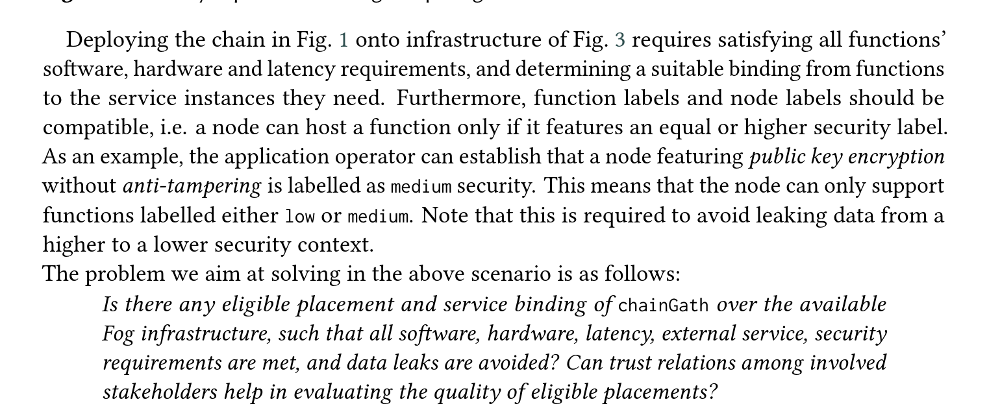

# Questions on the syllabus

**RESTful services**

1. How can we create/update/access resources in REST? Which are the pros and cons of REST?

   **In REST a resource is created/updated/accessed ecc. using HTTP methods. Clients invoke methods such as GET, POST, PUT, DELETE and request and responses  are used to trasnfer representaion of resources. Rest is resources centric and services are seen as reources identified by their URI. **

REST principles:

- Resource identification through URIs
  - Service exposes a set of resources which identify the targets of the interaction with its clients
  - Resources identified by URIs, which define global addressing space for resource & service discovery
- Uniform interface
  - Resources mainpulated using a fixed set of operations:
    - PUT and POST to create and update state of resource
    - DELETE to delete a resource
    - GET to retrieve current state of resource
- Self-descriptive messages
  - Requests contain enough context information to process the message
  - Resources decoupled from their representation so that their content can be accessed in a variety of formats (HTML, XML, JSON, Plain text, PDF, JPEG)
  - Metadata about the resourcescan be used to control caching and negotiat representation of state
- Stateful interactions through hyperlinks
  - Every interaction with a resource is stateless
  - Server contains no client state, any session state hold on client
  - Stateful interactions rely on the concept of explicit state transfer 

  **PROS:**

   - Simplicity
     - Low learning curve
       - Rest uses well known standards such as HTTP and the necessary infrastructure is already pervasive
     - Minimal tooling necessary to deploy services
       - Similar to building a dynamic web site
       - no custom client-side software
       - Can begin testing using a simple web browser
     - Because of URIs and hyperlinks we can discover web based resources without complusory registration to a repository
   - Efficiency  
     - lightweight protocols and message formats
   - Scalability
     - stateless RESTful web services can serve a very large amount of clients

​	  **CONS**:

  - Confusion on best practices( should i use POST OR PUT? What code should i return? What is the correct URI?)

  - No commonly accepted marshalling merchanism, so it's challenging to encored complex data structures in a URI
  - Not easy to extend restful services to support advanced functionalities in an interoperable manner
  - Very easy to make decisions on restful services that can cause significan technical risks and development effort(e.g design of the specification of resources and URI addressing scheme)

​					

​		

2. What is OpenAPI?

​	**OpenAPI is a open source specification that is used to describe, produce, consume, and visualize RESTful APIs and web services. It is a format and initiative for designing and creating machine readable interface files that are utilized in producing, describing, consumingm and visualizing RESTful APIs and web services. The open API file permits software developers to define their API's essential including:**

* **Present endpoints and each endpoint's operations **

- **The input and output operation parametes**
- Authentication techniques
- Things like contact information, terms of use, license, and much more

The main advantage of using a standard definition is that the thid party users can interact with and understand the service with minimal implementation logic, as long as they are familiar with RESTful APIs basics. API specifications are either written in YAML or JSON, formats that are readable, and easy to understand for both machines and humans

**Microservices**

3. Why microservices?

​	The main two reasons for choosing a microservice 		architecture are:

-  Shorten lead time for new features and updates
- More effective scaling (horizontal scaling)

4. Which are the main characteristics, and the main pros and cons, of microservice-based architectures?

- Service orientation:
  - Application as sets of services
  - each application has its own container
  - lightweight communication protocols (REST), can be synchronous (HTTP) or asynchronous(RABBITMQ, REDIS)
  - Polyglot services
- Organize services around business capabilities
  - Agile methods, cross funcitonal teams, flat set of servies managed by many teams
  - Different teams with separated roles introduces a delay of communications (context switching)
- Decentralized data
  - Each service has its own db, which will be smaller
  - Eventual consistency and compensations instead of distributed transactions
    - We accept some inconsistencies, but they ill be consistent some time in the future
- Independently deployed services
  - Ideally each service should be started without any dependency, should reduce coupling as much as possible
- Horizontal scalability
  - replicate only services that actually needs the scaling, not the entire application
    - Must be careful when dealing with endpoint based communication with other service (this is a smell, should be addressed with service discovery or a message router)
- Fault resilient services
  - Avoid cascading failures
  - Must have fault tolerant design
  - Any call can fail for any reason, must handle these as graceful as possible
  - Design for failure (chaos testing, fault injection)
- DevOps culture, you build it, you run it

**CONS**:

- Dont even consider microservices unless you have a system that's too complex to manage as a mnoloith
- Communication overhead
- Architecture complexity
- "wrong cuts", maybe you split it wrong and two services are tighlty coupled, very empirical process
- Very hard to avoid data duplication

- security managment very complex, attack surface broadesn (need effective way to handle authorization and authentication)

5. Which refactoring can be applied to resolve architectural smell X? How can we automate the generation of a model of a
    microservice-based architecture?

  **REFACTORING**

  | **PRINCIPLE**             | **SMELL**                           | **SOLUTION**                                                 |
  | ------------------------- | ----------------------------------- | ------------------------------------------------------------ |
  | Independent deployability | Multiple services in one container  | One service for each container                               |
  | Horizontal scalability    | endpoint based-service interactions | message broker(14%),message router(31%), service discovery(55%) |
  | Horizontal scalability    | no API gateway                      | add API gateway                                              |
  | isolation of failures     | wobbly service interactions         | bulkhead(20%), message broker(16%), timeouts(22%), circuit breaker (42%) |
  | decentralisation          | shared persistence                  | merge services (9%), data manager (41%), split databse (50%) |
  | decentralisation          | ESB misuse                          | rightsize ESB -> smart endpoints, dumb pipes                 |
  | decentralisation          | single layer teams                  | split teams by services                                      |

  **MODEL GENERATION**:

   Use modelling tools for microservice architecture  that gets in input a representation of the model (.tosca, similar to xml) and can generate (partial) concrete model specification (kubernetes images, istrio, a more complete .tosca file ecc.) -> $$\mu Freshner$$

  

6. What is Flask? Flask is a lightweight  WSGI web application micro framework. It is a python module that aims to simplify the development of web-based applicationa that communicate through HTTP. Micro does not mean that these apps are very small, but it means that flask tries to keep its core very simple but modular, with the possibility of adding many plugins and extensions (in fact many exists for different task such as form handling, interaciton with message brokers, testing ecc.). Tries to make as little decisions as possible, not enforcing any particular architecture or code style.

7. What is a container/image/volume in Docker? Which are the differences between a virtual machine and a container?

   Container:

   - A sandboxed process on a host machine that is isolated from all other processes on the machine , leveraging kernel namespaces and cgroups (very bound to posix machines). It is used to host a lightweight OS stack that supports running a SINGLE command. This single command can be any program compatible with the OS stack (usually a web app instance)-

   Image:

   - A docker image provides the custom filesystem that is needed for the isolated process (add libraries, dependencies, files ecc.).  It can be seen as a "programmable" chroot, but a container extends this to not only files but also process resources. The image contains everything needed to run the application,  and other configuration for container, such as environment variables a default command to run, user credentials for a specific service ecc.

   Volume:

   - Data volumes persist data independent of a container's life cycle. When you delete a container, Docker engine does not delete any data volumes.  You  can share volumes across multiple containers. Moreover, you
     can share data volumes with other computing resources in your system.

8. What is the effect of docker build/run/commit? What is Docker Compose?

   Docker build builds	2 a new image based on a specification written in a Dockerfile. Docker run execute a command in a new container created on the basis of a specified image, using the default comand in the image (if exists) when a command is not provided. Commit creates a new image based on a container change to the image that it was built on.

**Software testing**

9. What is development/release/user testing? What is TDD? What is partition testing? What are “software inspections”?

   **FIRST**:

   1. Development testing: all testing activities that are carried out by the team developing the software. The tester is usually the programmer developing the software. Can be more formal for critical system, with a specific testing group in the developing team (general trends is agile methods, no separation between testers and devleopers).

     Three stages:

     - Unit testing , where individual functions or methods are tested. Unit testing should focus only on testing the functionality of these methods and functions.
     - Component testing, where several individual units are integrated to create composite components (modules). In this phase we should test the interface that provides access to these functions.
     - System testing, where some or all the components are integrated and the system is tested as a whole. Should focus on interactions between components.

   2. Release testing: 

       - Testing release of system intended for use outside of development team

         Primary goal: convince system supplier that is good enough to use

         Black box tests derived from system specification

         It is a form of system testing:

         - Separate not developing team should be responsible

         - Objective of release testing is to check that the system meets its requirements and is good enough for external use (validation testing)

         Requirements-based testing

         ▪ Design test(s) for each requirement

         ▪ Validation testing

         Scenario testing

         ▪ Exploit typical scenarios of use to develop test cases

         ▪ A scenario is a (narrative) realistic story

         Performance testing 

         ▪ Check that system can process its intended workload

         ▪ Operation profiles* employed to test whether performance requirements are being
         achieve

   3. User testing

      - Users provide input and advice on system testing

          Essential, users real working environment can't be fully replicated but it can impact reliability/performance/usability of system

          Types of user testing:

          - **Alpha testing**
            - Users work with development team to test early releases of software

          - **Beta testing** 
            - Release made available to larger group of users, allowing them to experiment and raise problems discovered to the system developers

          - **Acceptance testing**

            - Customers test a system to decide whether or not it is ready to be accepted from the system developers and deployed in the customer environment

    Acceptance criteria should in principle be part of system contract (in practice requirments change during development)
    
          Outcome of negotiations can be conditional acceptance, e.g deploy even with problems that needs to be fixed

   **SECOND**:

   Test Driven Development is a programming style where software design and implementation are driven by testing. You first write a test for the new functionality that you want, you check that it fails (as it should if the functionality was not intended before), then you write the code that implements the functionality, and rerun the test and verify that it succeed. You repeat this loop until the test passes. This has many benefits including incremental change, simpler solutions and easy to document functionalities (essentially the test should make clear what are the expected inputs and outputs). 

   **PROS**

   - code coverage. Each code segment should have an associated test( not always true, usually a >90% coverage is the ideal targets)
   - regression testing. When adding new code you can rerun all the tests and check that it does not break anything (no spaghetti code!)
   - Simplified debugging, it's immediate to see where is the problem
   - System documentation, the tests themselves are documentation

   **THIRD**:

   Partition testing is a technique used in unit testing to effecitvely test groups of related inputs that should be treated equally:

- Identify the groups
- Choose inputs from each groups
- Rule of thumb: take inputs at boundaries (edge cases) and in the middle(normal cases) of the group.

10. What is Locust?

Locust is a open source load testing  python tool. It provides a python library and a simple web interface to generate a various number of API calls to stress test an application. A locustfile.py must be provided where some varius user api calls are defined. The number of these calls and the rate are dfined with the web interface

**User stories**

11. What is a user story? Which are the six main attributes for a good user story?

**What is a user story**:

**User stories** are short, simple descriptions of a  feature told from the perspective of the person who desires the new  capability, usually a user or customer of the system. They typically  follow a simple template:

> As a < type of user >, I want < some goal > so that < some reason >.

User stories are often written on index cards or sticky notes, stored in a shoe box, and arranged on walls or tables to facilitate planning  and discussion. As such, they strongly shift the focus from writing  about features to discussing them. In fact, these discussions are more  important than whatever text is written

Six main attributes (INVEST):

1.  **Independent**: User stories should not have interdependencies between them. Otherwise, theyr are difficult to separate by priority, planning and estimation .

2. **Negotiable**:  User stories should be flexible and can be negotiated in discussions between the customer and the development team during development. Remember that  they're short description of features from the user perspective.

3. **Valuable to users**:  user stories must provide description of features that are valuable to end users, and as such should not be focused on technological and programming aspects.

4. **Estimatable**: It is essential that the size of a story can be estimated by developers. The better the estimate of story points, the cleare will be the priority and implementation.

5. **Small**: A good story captures the essence, not the details. Over time the story may acquire, notes details, test ideas and so on but we don't need these to proiritize the story

6. **Testable**: A good story should be testable.
   “Writing a story card carries an implicit
   promise: I understand what I want well

   enough that i could write a test for it"

**Business process modelling**

12. What is a parallel/exclusive/inclusive gateway in BPMN?

    

13. What is a workflow net? What is a sound workflow net? What is a live/bounded Petri net?

    **What is a workflow net**:

    Extension of petri nets.

    Petri nets consists of places, transitions and direct arcs connecting places to transitions. Transitions model activities, places and arcs model execution constraints.

    System dynamics represented by tokens, whose distribution over the places determines the state of the modelled system.

    A transition can _fire_ if there is a token  in each of its input places

    If a tranistion _fires_, one token is removed from each input place and one token is added to each output place.

    **A Petri net is a workflow net iff**:

    1. There is a unique source place, with no incoming edge
    2. There is a unique sink place, with no outgoing edge
    3. All places and transitions are located in at least one path from the initial place to the final place

    **What is a sound workflow net**:

    > A workflow net is sound iff:
    >
    > 1. every net execution starting from the initial state (one token in the source place, no tokens elsewhere) eventually leads to the final state (one token in the sink place, no tokens elsewhere)
    >
    > 2. every transition occurs in at least one net execution
    >
    >    

    **What is a live/bounded petri net?**:

    > A Petri net (PN, M) is **live** if and only if for every reachable state M' and every transition t, there is a state M'' reachable from M' where t is enabled.
    >
    > A Petri net(PN, M) is **bounded** if and only if for each place p there is a n in N such that  for each reachable state M'  the number of tokens in p in M' is less than  n
    >
    > Theorem: a workflow net $N$ is sound if and only if  (N',{i}) is live and bounded, where N' is N extended with a transition from the sink place _o_  to the source place _i_

14. How can we model BPMN parallel/exclusive/inclusive gateways with workflow nets?

    

    INCLUSIVE GATEWAY:

    

15. What is Camunda? Which are the two “usage patterns” of Camunda?

**What is Camunda**:

Camunda is a framework supporting BPMN  for workflow and process automation.

It provides a RESTful API which allows to use any language

Workflows are defined via BPMN and can be graphically modeled using Camunda Modeller

**Usage Pattern**:

1. **endpoint-based integration**:

   After defining a BPMN process , Camunda can directly call  services via built-in connectors. It support REST and SOAP

   

2. **queue-based integration**

   Unit  of work (tasks) are provided in a Topic Queue, the queue is polled by RESTful workers that can interact with services ( better scaling).

   

**Security and microservices**

16. Which are the main challenges in securing microservices?     Which are the main “smells” in microservices security?

    **Challenges**

  The main challenges in securing microservices are embedded in the architecture itself. Since we have many services communicating with remote the number of entry points increases (broader surface attack) and the app is as secure as the weakest link. Other challenges:

  - **Distributed security screening**: each microservice has to carry out independent security screenin:
    - May need to connect to a remote security token service
    - repeated, distributed security checks affects **latency and performance**

    Work around: trust-the-network (industring moving to 0 trust policies)

  - **Bootstrapping trust among microservices**: Service to service communicatin must take place on protected channels. Suppose you are using certificates:
    - each microservice must be provisioned with a certificate (and private key) to authenticate itself to another microservice during interactions
    - Recipient microservice must know how to validate the certificate associated with calling microservice
    - Need to bootstrap trust
    - (need also to revoke and rotate certificates)

      Need automation for large scale deployments
  - **Tracing requests spanning multiple microservices**
    A log records an event in a service. A set of logs can be aggregated to produce metrics

    Traces help you track a request from the point where it enters the system to the point where it leaves the system

    **Challenging to correlate requests among microserives**
  - **Containers complicate credentials/policies handling**
    Containers are immutable servers that donìt change state after spin up

    But we need to mantain a dynamic list of allowed clients and a dynamic set of access control policies
      e.g get updated policies from some policy admin endpoint (push vcs pull model)
    
    Each service must also mantain its own credentials, which need to be rotated periodically
      e.g keep credentials in container filsystem and inject them at boot time
  - **Distribution makes sharing user context harder**. User context has to be passed explicitly from a microservice to another. How can we build trust so that a receiving microserrvice accepts an incoming user context? Popular solution: use Json Web Token
  - **Decentralised security responsabilities**
    Diffenrent teams can use different technlogoy stacks, and this can mean that they use different security practices and tools (i wish there was a unique solution) for static and dynamic analysis. 

    Security responsabilites distributed across different teams.

    Usually hybrid approach with centralized security team

**Smells**

| **Property**              | **SMELL**                               | **SOLUTION**                                                       |
| ------------------------- | --------------------------------------- | -------------------------------------------------------------------|
| Confidentiality           | Insufficient access control             | Use Oauth 2.0                                                      |
| Confidentiality           | Publicly accessible microservices       | Add API gateway                                                    |
| Confidentiality, Integrity| Unneccesary privileges to microservices | Follow the least privilege principe                                |
| Conf, Int, Auth           | Home made crypto code                   | Use established encription techniques                              | 
| Conf, Int, Auth           | Non encrypted  data exposure            | Encrypt all sensitive data at rest                                 | 
| Conf, Int, Auth           | Hardcoded secrets                       | Encrypt secrets at rest                                            |
| Conf, Int, Auth           | Non secured service-to-service comms    | Use mutual TLS                                                     |
| Authenticity              | Unauthenticated traffic                 | mutual TLS, openId Connect                                         |
| Authenticity              | Multiple user authentication            | Api gateway, OpenId Connect, single sign on                        |
| Authenticity              | Centralised authorization               | Decentralise authorization                                         |
-------------------------------------------------------------------
17. What is static/dynamic vulnerability analysis?

  Static vulnerability analysis is a type of white box analysis that has full access to the source code. It uses static analysis techniques to find security vulenrabilities that are caused by the code itself( e.g hardcoded secrets, old libraries with known vulnerabilities, bad crypto practices). 

  Dynamic vulnerability tesating is  a black box analysis. It tries to break the security control and find vulenrabilities by calling multiple applications API endpoints. Its purpose is to find bad designed authentication and authorization policies by exploiting a running application behaviour. IT casn find vulnerabilities such as no CSRF token, XSS, code injection problem, security misconfigs, unneccessary data exposusre ecc..

18. Which are the most frequent API security vulnerabilities?

    [See pdf](owasp-api-security-top-10-cheat-sheet-a4.pdf)
    
19. What are authentication and authorization? What are SAML, OIDS and OAuth2.0?

  **Authentication and authorization**

  1. Authentication
     
      Authentication is the **act of confirming the truth** of an attribute of a single piece of data or entity (user of an application, for instance).

      In the digital worlds we tend to simplify the confirmation by using **username and password** (the assumption is that password is known only by the indended user, so specifying the right password you're demonstrating you actually are who you pretend to be).
  2. Authorization

      Authorization is the function of **specifying access rights** to resources related to information security and computer security in general and to access control in particular
        - To authorize is to define an access policy
      
      In the digital world, defining the access rules user by user can be impractical

      Authorization is often implemented with the so called **Role-Based Access Control**( RBAC)
        - users are pooled in groups based on their organizational role (e.g payroll manager, project group A, ...)
        - access rights are then asssociated to roles
      
      When a user access an application:
        - authenticates himself / herself
        - activate one or more roles (depending on the groups of belonging)
        - access services by leveraging RBAC authorization

**What are SAML, OIDS and OAuth2.0?**

  1. SAML (Simple Assertion Markup Language) is a **standard** that **facilitates the exchange of security information**. It is an XML-based framework that enables different organizations ( with different security domains) to securely exchange authentication and authorization information.

      To create a SAML infrastructure:
        - an Identity Provider (IdP) must be **installed on top of each organization directory** to permit user authentication in the federation
        - a Service Provider (SP) must be **installed on top of each application** to consume authentication and authorization information obtained from the federation.

  2. OpenId Connect (OIDC) is a **standard** that **facilitates the exchange of security information**. OIDC is a framework that uses REST APIs and JSON format. OIDC enables different organizations (with different security domains) to securely exchange authentication and authorization information.

      To create an OIDC infrastructure:
        - an openID provider (OP) must be **installed on top of each organization directory** to permit user authentication to the federation (similarly to IdP in SAML)
        - a Relying Party (RP) must be **installed on top of each application** to consume authentication an authorization information obtained from the federation (similarly to SP in SAML)
  
  3. OAuth 2.0 is an IETF standard for authorization. OAuth2 defines a mean to represent the authorization granted to the third party, the access token, and a set of flows and mechanisms to:

  - obtain the authorization, that is the access token
  - convey the authorization to a third-party application
  - use the authorization on a protected resource
  
    All on top of the HTTP protocol
  
    **OAuth2.0 Actors**:
    - Resource Owner (RO): the granting access entity, usually the user and his User Agent
    - Resource Server (RS): the server hosting the resource to be accessed (e.g. an API)
    - Client: the application to which the grant is entitled (a web app, a desktop app, a mobile app, a javascript-on-top-of-user-agent app ...)
    - Authorization Server (AS): register clients, authenticates users, and issues access tokens.
    
    

  **Access token**: a sring representing an authorization issued to the lient (for which is usually opaque). <ins>OAuth 2.0 does not mandate the format nor the content of the access token</ins>
    
  **Refresh token**: credentials used to obtain access tokens when the current access token becomes invalid or expires.
    
  **Scopes**: set of rights delegated to the client on the Resource Server - expressed as a list of space-delimited, case sensitive strings.
    
    **Protocol Endpoints**:
      - Authorization endpoint (Authorization Server)
      - Token endpoint (Authorization Server)
      - Redirection Endpoint (Client)\[<ins> SHOULD require the use of TLS by RFC 6749 </ins>\]
    
    **OAuth 2.0 Flows**:
      - Authorization Code Grant
        It is the main flow to obtain an access token, and mainly targeted to web applications.
        - client authentication
        - employ an intermediate authorization phrase represented by an authorization code
        - The access token is exchanged without the involvment of the Resource Owner User Agent
      - Implicit Grant. A simplified authorization code flow optimized for clients implemented in a browser.
        - No client authentication
        - No intermediary code to obtain the access token
      - Resource Owner Password Credentials Grant. It is a flow for highly trusted clients:
        - the resource owner credentials are used directly by the client to obtain an authorization

**Splitting the monolith**

20. When and where to start splitting a monolith codebase? How to split databases?

    **When and where**

    We must start to split a monolith only *when* it becomes a problem. How to define when it becomes a problem is context dependant but there are some usal indicators:

    - Codebase has fast pase of change and functionalities continously added
    - A lot of code kept together is unrealted
    - loose coupling impact performance and manteinance, monolith alwasy deployed all otgether

    Where:

    Find the seams: portion of code that can be treated in isolation and worked on without impacting the rest of the codease

    Bounded context, exploit notion of software modules &rarr; create packages representing bounded conext and move existing code (refactor it !) in them

    Which context to move first depends on the application and the motivations for splittin

    typical drviers:

    - pace of change
    - team structure
    - security
    - technology
    - tangled dependencies

    **How to split db**

    find the seams in the db. Understand which code read and writes db and detect constraints(e.g foreign key relationship used by different parts of code)

    - Breaking foreign key relationship

      Services uses info of other service via db foreign key 

      Solution: expose data via API in the checked service package

      - More overhead but foreign key lost, constraints managed at the service level, need to implement consinstency checks

    - Shared static data

      - Duplicate tables (possible consistency problem)
      - Treat data as code (config files). Easier to update config files than db tables even with consistency issues
      - Expose a separate service (possibly overkill)

    - Shared mutable data

      - Solution: move shared data in a new service that can be invoked through API

    - Shared tables

      Solution: split table in two, move used contexts to each service needing it. Store two concepts separatelt

      

    

21. What is the CAP theorem? What is the SAGA pattern?

    **CAP THEOREM**: In presence of network partition, you cannot have both availability and consistency

    - Consistency any read operation beginning after a write operation must return that valure or the result of a later write operation

    - Availability: every request received from a non failing node must result in a response
    - Network partition: network can lose arbitrarily many messages sent from one group to another

    **SAGA PATTERN**:

    A pattern to implement distributed transactions in a lightweight manner.

    Implement each business transaction spanning multiple services as a saga

    A *saga* is a sequence of local transactions

    Each local transaction updates a database and triggers next local trnasactions in the saga

    If one local transaction fails the saga executes compensating transactions (rollback)

    Two ways to coordinate these:

    - Coreography: each local transaction publishes event that triggers next transactions in the  saga
    - Orchestration, an orchestrator tells local participants the transaction to execute

    Compensating transactions:

    - Backward model, undo changes
    - Forward model, retry later (possibly with timeouts and circuit breakers)

22. What is a (event) data pump?

    Data pumps are needed to keep updated the reporting db, which is usually kept as a copy of the actual db. Challenging to update when multiple dbs. When  the db is updated, data is pushed to the reporting systems (possibly in bulks and not every individual transactions)

    Normal data pumps:

    - data  pushed directly to the reporting system
    - data pump maps service db to the reporting schema
    - data pump version controlled together with service
    - coupling worth to makw reporting easier
    - data pump built & managed by the team managing serviceù

    Event data pumps:

    - Microservices emits events based on the state change of entities managed
    - write event subscribers listen for these events and pump data in the reporting database
    - no coupling with service
    - just binding to events meant to be exposed
    - event based is usually faster than periodically scheduled data pumps
    - can be managed independently
    - drawback: all info broadcasted as event, not very good scaling for large volumes of data

**Cloud-IoT continuum**

23. What is Fog computing? What are (declarative) application placement and continuous reasoning over the Cloud-IoT
    continuum?

    

    Declarative placement:

    App deployment becomes a very complex problem (NP Hard) in a Fog context. You have a set of App requirements (Hardware, Software, QoS) and a fog infrastructure (Heterogenenous, Large, Dynamic).

    How to decide the "best" place to deploy an application component?

    How to estimate a "good" placement?

    Especially challenging for mission critical applications.

    A solution is to convert the problem to a *declarative problem*. You use a specific syntax to declare what constraint you want to satisy and you let an automatic solver find all the possible *placements*. We can model requirements as predicates and use Prolog.

    You describe what you want in the solution, NOT how to achieve it.

    A problem with this approach is the fact that fog structures are dynamic. Two main issues:

    - Prolog is a fact based approach. Need to use a probabilistic approach to model the possibility of unexpected changes &rarr; Problog predicates

    - Handling redeployments in the presence of infrastructure changes. Redeploying  the entire system at any change is going to be too complex (NP Hard problem, exp worst time) and a waste of resources since we  dont need to change placements not affected bu the infrastructure changes.

      We solve the last issue with continous reasoning:

      Continuous reasoning is a technique inspired by things like CI/CD and usually used in software enginnering to differentially analyse large-scale system by exploiting compositionality. We mainly focus on latest changes and reuse computed results as much as possible (e.g FB Infer, works on diff and not the entire source code all the time).

      Continuous reasoning for application placement:

      What for?

      - Scale to larger instances of the placement problem
      - Reduce time needed to make placement decisions at runtime
      - Possibly reduce the number of management operations (stop, undeploy, deploy, start)
      - How?  Re-place only services affected by infrastructure and CI/CD changes

24. How can we assess the security level of an application deployment? How can we model trust?

    Enforcing security in a fog context can be quite challenging.  A fog architcture increase the attack surface by exposing a lot more of possible entry points and shares a lot of the threats with cloud computing (enforciing isolation, man in the middle ecc.)

    It is also to exposed to more peculiar threats because fog nodes are physicially accessible (social engineering, access security in place ecc.)

    We can use a declarative approach  for security as well.

    We first define a taxonomy of possible secruity measure that a Fog infrastructure can enforce. This ranges from mitigation measures for software vulnerabilities, access and communication control , sensitivie data control, Physical security ecc.

    Fog infrastructure is managed by *multiple* operators. Indeed a fog deployment span various service providers. To manage and assess security we assume that each node self-describes its capabilities and effect against attacks with a node descriptor that uses the taxonomoy described. This allows us to have  a complete view of the available security capabilities.

    On the other hand we have an app operator that  describes the app topology and its security requirements both at the component and application level leveraging the taxonomy.

    Security requirements can be desscribed with custom security policies in terms of default security policies specified by the model (in this case SecFog). The app operator can also specify complete and partial deployment of application and the trust degrees towards different infrastructure operator.

    This constitute the security requirements of the multi component app. 

    We leverage a reasoning enginge (problog) that takes as input the requirements and capabilities  and outputs possible deployments annotating them  with their security level.

    **Modeling trust**:

    We build a trust network where operators are nodes and directed arc between them are annotated with the associated trust level ( opinions). 

    Default trust model:

    - opinions along paths are combined via multiplication
    - opinions across paths are combined via addition

    Limitation in the default model:

    1. It is monotonic, all paths toward  a provider increases trust degree towards it

    2. Unconditionally transitive (if A trusts B and B trusts C &rarr; A trusts C)

       We can use more sophisticated models using semirings

    **Commutative semiring**

    An algebraic data structure  consisting of a 5-tuple:

    $(S, \oplus, \otimes, 0, 1)$

    where S is a set of elements and $$\oplus$$ and $$\otimes$$ are two binary operators defined over $$S$$ such that:

    - $$\oplus$$ is commutative and associative, with 0 as its neutral element
    - $$\otimes$$ is associative, distributes over $$\oplus$$ and 1 and 0 are its neutral and absorbing element

    **A different trust model**

    

    Non monotonic and optimistic model.  A pessimistic model takes the minimum instead.

    **Conditional transitivity**

    Limit transitivity to a radius. As an example, if we pick a radius of 3 a operator transitivitely trsuts only the next three operator along a path in the trust network.

25. What is secure FaaS orchestration?

First of all we define FaaS. FaaS stands for Functions as a Service and it's the more recent cloud computing model. In this model, a platform is provided to define stateless, event-triggered functions. A user provides the code of the function, the trigger and how to handle the results. There is a total abstraction from the target deployment stack, and the underlying infrastructure is not specified by the end user. This allows a simplified deployment for applications that can use this model with very low execution costs. Particularly suited for IoT data computation 

FAAS

PROS:

- Costs
- Scalability
- Productivity
- Avg latency

CONS:

- Cold starts
- No persistent state
- Non concurrency controls

FaaS meets Cloud-IoT Continuum

Key Idea: deplo functions on nodes near the edges 

- Improve QoS of FaaS
- Event Driven Programming
- Better resource management

This rises non trivial security problems

Security issues:

- Reduced Trust Computing Base
- Devices can be easily hacked, stolen, or broken
- Isolate users to calculate accounting and billing
- Privacy

FaaS + C-I cont. + Security

Applications for:

- Environmental monitoring
- Diseases tracking
- Home automation
- Vocal assistants
- Smart agriculture

Three perspectives:

- Defining FaaS orchestrations
- Executing FaaS  orchestrations in the C-I cont.
- Securing FaaS orchestrations

**Define FaaS orchestration**

Languages, models, and methodlogies to define FaaS orchestrations

Findings:

- High support for basic programming constructs (sequential, conditonal branches, loops...)
- Direct triggers vs publish/subscribe invocation
- Recursive functions supported (but not particularly liked)
- Low support for type checking functions

**Executing FaaS orchestrations  in the C-I cont.**

Platforms, techniques and methodologies to execute FaaS orchestrations in the C-I Cont.

Findings:

- High support for latency and resource management
- Cost-awareness has good consideration
- Data- and bandiwth-awareness considered by few works

**Securing FaaS orchestrations**

Techniques and methodologies to secure FaaS orchestrations both statically and at runtime

Findings:

- Data confidentiality and function integrity are the main assets protected
- The main threat is given by external attacks, but also cloud providers and developer mistakes are highly considered 
- The main protection techniques are hardware isolation and information flow security

**Research challenges**

P1 ^ P2 (Definfing FaaS orchestrations ^ Executing FaaS orchestrations in the C-I Cont )

- Orchestration aware execution:

  Exploit orchestration to place and execute functions (instead of considering single functions)

- Definition and Execution of context-aware and Qos-aware orchestration

  Add context  and QoS requirements to functions and orchestrations to support placement and execution 

P1^P3 (Defining FaaS orchestrations ^ Secure Faas Orchestrations)

- Definition of security requirements:

  Add to function orchestrations security requirements on functions (e.g specific nodes execution)., orchestrations(e.g policies defined on set of functions), and data (e.g defining and exploiting security levels).

- Static analysis of FaaS orchestrations:

  Analyse statically defined FaaS orchestrations using the afromentioned requirements to support placement and execution

P2^P3 (Executing FaaS orchestrations  in the C-I cont. ^ Securing FaaS orchestrations)

- Secure executions in the C-I Cont.

Security is measured and enforced with a similar approach to secofog (declarative approach based on a trust network).

​	

